# <center>基于TCP协议的网络聊天室</center>
###### <center>171180503 周晨晨  171180506 李昕宸 171180629 陈宇星 </center>  

## 1. 服务器端

#### 1.1 简介

&emsp;&emsp;为实现多人实时在线聊天的功能，所有的用户需要连接到一个共同的服务器以发送信息或获取他人信息，服务器在其中起到信息集中于管理的作用。  


#### 1.2 运行及开发环境

服务器端运行于IP：122.152.205.193的服务器上，开放1778号端口供该项目使用，服务器运行64位Ubuntu 18.04.2 LTS server操作系统。程序使用C语言编写，使用gcc编译器编译。


#### 1.3 用户数据库读取与建立

每一个用户使用前需要注册聊天室账号，登陆后方可进入到聊天室中，未注册用户初次登陆需要首先注册账号。所有用户的账号与密码信息以字符串形式保存至服务器端的 log_in.ini配置文件中，当服务器程序运行时将从配置文件中读取所有的用户信息及密码，并存储到程序内建的struct结构组中构成用户数据库，每当收到用户登录请求时直接比对数据库判断账号与密码是否匹配，匹配成功则允许登录到聊天室，并置该用户的登陆状态log_status=1，否则拒绝其登录请求。  

代码如下：

```c
//server.c
struct users_info
{
	char name[32];
	char pswd[64];
	int log_status;
};

//void main()
users_info* USERS;
FILE* fp;
if((fp=open("log_in.ini","r"))==NULL)
	{
		exit(-1);
	}
	int count;
	fscanf(fp,"%d",&count);
	USERS=(users_info*)malloc(count*sizeof(users_info));
	for(int k=0;k<count;k++)
	{
		char name[32],pswd[64];
		fscanf(fp,"%s\n",name);
		fscanf(fp,"%s\n",pswd);
		strcpy(USERS[k].name,name);
		strcpy(USERS[k].pswd,pswd);
		USERS[k].log_status=0;
	}
	fclose(fp);
```


#### 1.4 TCP监听

聊天程序使用TCP协议，服务器在完成数据库加载及初始化操作后，随即进入主程序循环监听状态，等待接收来自用户的连接请求，并做出响应。
用户端调用函数：

```c
connect(sockfd,(struct sockaddr *)(&server_addr),sizeof(struct sockaddr))
```
向服务器发出连接请求，服务器端运行等待监听函数：

```c
accept(listenfd,(struct sockaddr *)(&client_addr),&sin_size))
```
当无连接请求时，函数在accept处等待，当有连接请求时，返回所接收到socket套接字的描述值（正常情况返回值 $\ge0$）。
当有建立连接请求时，服务器端给出响应，服务器与用户程序完成”三次握手“，建立TCP连接。

聊天室设有登录人数限制，人数上限为$100$人，也即最多创建$100$个子进程处理收发信息。

程序启动时创建长度为$100$的socket套接字容器，用于存储每一个用户的TCP套接字描述值，并将其全部初始化为$-1$，表示当前序号的套接字未被占用。每次监听前，通过循环找到索引值最小的描述值为$-1$的序号，信息匹配成功后即将该用户的套接字描述值赋值给容器的对应序号。

```c
for(i=0;i < LISTEN_MAX;i++)
{
	printf("i == %d\n",i);
	if(connfd[i]==-1)//表示套接字容器空闲，可用
	{
		break;
	}
}
if(i==LISTEN_MAX)
	full_flag=1;
else
	full_flag=0;
printf("before accept i == %d\n",i);
//服务器阻塞,直到客户程序建立连接
sin_size=sizeof(struct sockaddr_in);
int conn;
if((conn=accept(listenfd,(struct sockaddr *)(&client_addr),&sin_size))==-1)         
{
	perror("accept");
	continue;
}
```


#### 1.5 登录请求处理

当用户程序与服务器端建立TCP连接后，用户端随即分三次向服务器端发送注册/登录信号、账号、密码信息。
为确保可靠性，服务器端每接收到一个信息，随即向客户端发送”OK“以示收到，客户端收到”OK“后再发送下一个信息，直至完成登录信息的发送。

```c
memset(buffer,0,SIZE);
recv(connfd[i],buffer,SIZE,0);
strcpy(construction,buffer);
strcpy(buffer,"OK");
send(connfd[i],buffer,SIZE,0);
		
memset(buffer,0,SIZE);
recv(connfd[i],buffer,SIZE,0);
strcpy(name,buffer);
strcpy(buffer,"OK");
send(connfd[i],buffer,SIZE,0);

memset(buffer,0,SIZE);
recv(connfd[i],buffer,SIZE,0);
strcpy(pswd,buffer);
```
完成登录信息传递后，服务器端随即按照登录或注册申请分别执行检测与重建，若用户账号或密码输入错误，分别返回不同的错误代码到用户端，用户端再解析为不同的个错误提示信息，具体错误信息如下：

返回代码 | 提示信息 | 相应操作
:---:|:---:|:---:
OK | 登陆成功 | 允许登录
OK1 | 注册成功，自动登录 | 允许登录
error1 | 密码错误 | 拒绝登录请求
error2 | 用户账号错误,未注册 | 拒绝登录请求
error3 | 用户已登录（重复登陆） | 拒绝登录请求
error4 | 用户名重复（重复注册） | 拒绝注册请求
error5 | 最大线程数已满（聊天室人数已满） | 拒绝所有请求

具体登录信息处理代码如下：
```c
memset(buffer,0,SIZE);
int judge=0;
if(strcmp(construction,"log_in")==0)
{
	for(int k=0;k<count;k++)
	{
		if(strcmp(name,USERS[k].name)==0)
		{
			judge=1;
			if(strcmp(pswd,USERS[k].pswd)==0)
			{
				judge=2;
				if(USERS[k].log_status==0)
				{
					USERS[k].log_status=1;
					user_id=k;
					judge=3;
					break;
				}
			}
		}
	}
	if(judge==0)
		strcpy(buffer,"error2");//无此用户信息，未注册
	else if(judge==1)
		strcpy(buffer,"error1");//密码错误
	else if(judge==2)
		strcpy(buffer,"error3");//重复登陆
	else if(judge==3)
		strcpy(buffer,"OK");//登录成功
	else
		strcpy(buffer,"ERROR");//未知错误
}
else//注册
{
	judge = 3;
	memset(buffer, 0, SIZE);
	for (int k = 0; k < count; k++)
	{
		if (strcmp(name, USERS[k].name) == 0)
		{
			judge = 0;
			strcpy(buffer, "error4");
		}
	}
	if (judge != 0)
	{
		strcpy(USERS[count].name, name);
		strcpy(USERS[count].pswd, pswd);
		USERS[count].log_status = 1;
		user_id=count;
		count++;
		fp = fopen("log_in.ini", "w");
		fprintf(fp, "%d\n", count);
		for (int k = 0; k < count; k++)
		{
			fprintf(fp, "%s\n", USERS[k].name);
			fprintf(fp, "%s\n", USERS[k].pswd);
		}
		fclose(fp);
		strcpy(buffer, "OK1");
	}
}
send(connfd[i],buffer,SIZE,0);
if (judge != 3)
{
	connfd[i]=-1;
	continue;
}
memset(buffer,0,SIZE);
recv(connfd[i],buffer,SIZE,0);
if(strcmp(buffer,"OK")!=0)
	continue;
```


#### 1.6 多线程处理接收信息

##### 1.6.1 总述

为应对多个用户同时登陆，单线程处理难以完成同时应对多个用户的收发信息操作。
因此，特引入多线程机制，为每一个登录的用户创建一个接收信息同时转发信息到其它用户的子线程，以处理随机产生的接收、发送操作。
多线程编程的头文件以及几个重要的函数为：

```c
//头文件
#include<pthread.h>
//进程生成函数
pthread_create(&thread_handle, NULL, pthread_handle, &socked_index);
//进程结束函数
pthread_exit(0);
```
服务器每完成对一个用户的登录信息处理并完成登录后，除向用户发送欢迎信息外，还会创建一个用户对应的专用子进程，用于接收并处理该用户发送的信息，并同时转发到其它用户端，实现消息的同步。同时释放主线程资源，达到更快的响应，避免阻塞。  

程序每次收到信息也会将所收到的信息存储到record.log日志文件中。

子线程创建函数如下：
```c
unsigned int socked_index=i;
socked_index=socked_index<<16 | (unsigned int)user_id;
ret = pthread_create(&thread_handle, NULL, pthread_handle, &socked_index);
if(ret != 0)
{
	perror("Create pthread_handle fail!");
	exit(-1);
}
```

子线程负责监听对应用户发送的信息，根据所收到信息的系统信号头的不同，来判断信息的类型，并做出响应操作。信号头与信息类型的对应关系如下表：

|       信号头       |   消息类型   |                           对应处理                           |
| :----------------: | :----------: | :----------------------------------------------------------: |
|  SYS_SIGNAL_QUIT   | 用户退出信号 | 向其余用户转发该用户退出的系统信息，清除该用户登录标志，退出该子线程 |
|   SYS_SIGNAL_IMG   |   图片发送   | 从信号头中解析出图片名称、大小，重命名并接收到recv_imgs文件夹下；接收完成后再依次转发至所有用户 |
|  SYS_SIGNAL_FILE   |   文件发送   | 从信号头中解析出文件名称、大小，重命名并接收到recv_files文件夹下；接收完成后再依次转发至所有用户 |
| SYS_SIGNAL_EMOTION |   表情发送   | 从信号头中解析出重编码后的emoji表情编码，添加信号头转发至所有用户 |
|         无         | 普通文本信息  | 添加时间、用户名等信息后转发至所有用户  |


##### 1.6.2 退出信号

当程序解析出退出信号时，表明该客户端即将退出登录，服务器端即将该用户的登录状态标志重置为0，同时更新在线人数，发送该用户退出的系统消息到所有客户端。

##### 1.6.3 图片及文件传输

###### 1.6.3.1 接收准备

当程序解析出图片或文件的传输信号时，由文件/图片传输统一组合规则：
```
SYS_SIGNAL_IMG/SYS_SIGNAL_FILE:文件名:文件大小(字节)
```
随即可使用strtok函数从信号中解析出将要接收的文件名、文件大小：

```c
char *p;
char split[10][100]={0};
const char *delim=":";
int split_count=0;
long count;
char img_name[SIZE];
p=strtok(buffer,delim);
while(p)
{
	strcpy(split[split_count++],p);
	p=strtok(NULL,delim);
}
```

根据命名规则，解析所得的split数组的三层分别对应于：

|   层数   |         意义          |
| :------: | :-------------------: |
| split[0] |        信号头         |
| split[1] |      图片/文件名      |
| split[2] | 图片/文件大小（字节） |

再将图片/文件名添加时间轴和文件夹信息，使用fopen函数在对应接收问文件夹中创建该文件，同时使用atol函数将文件大小转换为long长整型，准备从网络接收该图片/文件。

###### 1.6.3.2 接收过程

考虑到网络传输存在一定的随机干扰，使用函数 ```recv(connfd[index],buffer,SIZE,0)``` 接收时一次接收不一定就能够接收到```#define SIZE 1024``` 个，此时直接向文件中写入SIZE个字符可能会导致文件出错。因此，在接受是需要采用如下方式，双重校验：

```C
FILE *img=fopen(img_name,"wb");
count=atol(split[2]);
while(count>0)
{
	memset(buffer,0,SIZE);
	long recv_len=recv(connfd[index],buffer,SIZE,0);
	fwrite(buffer,sizeof(char),recv_len,img);
	count-=recv_len;
}
fclose(img);
```

###### 1.6.3.3 文件、图片转发

服务器端完成接收后，随即向所有用户以相同方式转发该文件/图片。具体实现过程如下：

```C
//向用户转发图片
struct stat statbuf;
stat(img_name,&statbuf);
count=statbuf.st_size;

online_count=0;
for(int ss=0;ss<LISTEN_MAX;ss++)
if(USERS[ss].log_status)
	online_count++;
memset(time_ch,0,SIZE);
sprintf(time_ch,"SYS_SIGNAL_IMG:%s:%ld:",img_name,count);
memset(buff,0,SIZE);
time(&timep);
p_curtime = localtime(&timep);
strftime(buff, sizeof(buff), "%Y/%m/%d %H:%M:%S\n", p_curtime);
strcat(buff,USERS[k].name);
strcat(buff,":\n\t");
strcat(buff,"发送了一张图片,已保存到程序目录下recv_imgs文件夹下");
strcat(time_ch,buff);

for(i = 0; i < LISTEN_MAX ; i++)
{
	if(connfd[i] != -1)
	{
		if(send(connfd[i],time_ch,SIZE,0) == -1)
		{
			connfd[i]=-1;
		}
		if(connfd[i] != -1)
		{
			long send_count=count;
			img=fopen(img_name,"rb");
			while(send_count>0)
			{
				memset(buffer,0,SIZE);
				fread(buffer,sizeof(char),SIZE,img);
				long send_len=send(connfd[i],buffer,SIZE,0);
				send_count-=send_len;
			}
			fclose(img);
		}
	}
}
```


##### 1.6.4 表情传输

当服务器解析出表情传输信号时，根据表情传输信号命名规则：

```
SYS_SIGNAL_EMOTION:表情编号.png
```

通过与上述相同方式解析出表情的编号，添加信号头以及信息内容后，依次转发给所有用户。

服务器发出时信号组合规则如下：

```
SYS_SIGNAL_EMOTION:表情编号.png:系统信息
```

用户端以相同方式解析出表情编号及系统信息后，根据不同类型客户端的特性选择性显示出不同部分的信息。

具体实现方式如下：

```C
else if(strncmp(buffer,"SYS_SIGNAL_EMOTION:",18)==0)//表情
{
	char *p;
	char split[5][100]={0};
	const char *delim=":";
	int split_count=0;
	long count;
	char file_name[SIZE];
	p=strtok(buffer,delim);
	while(p)
	{
		strcpy(split[split_count++],p);
		p=strtok(NULL,delim);
	}
	char emoji[100];
	strcpy(emoji,split[1]);
	memset(buff,0,SIZE);
	time(&timep);
	p_curtime = localtime(&timep);
	strftime(buff, sizeof(buff), "%Y/%m/%d %H:%M:%S\n", p_curtime);
	strcat(buff,USERS[k].name);
	strcat(buff,":\n\t");
	strcat(buff,"向您发送了一个表情，该客户端暂不支持查看");
	
	memset(time_ch,0,SIZE);
	sprintf(time_ch,"SYS_SIGNAL_EMOTION:%s:%s",emoji,buff);
}
```


##### 1.6.5 普通信息传输

对于未添加信号头的信息，系统判定为普通文本信息，对于这样的信息，服务器端直接在信息前添加系统时间、用户名信息，转发给所有用户。

```
else//用户发送消息
{
	online_count=0;
	for(int ss=0;ss<LISTEN_MAX;ss++)
		if(USERS[ss].log_status)
			online_count++;
		memset(time_ch,0,SIZE);
	sprintf(time_ch,"SYS_SIGNAL_ONLINE_COUNT:%03d ",online_count);
	
	memset(buff,0,SIZE);
	time(&timep);
	p_curtime = localtime(&timep);
	strftime(buff, sizeof(buff), "%Y/%m/%d %H:%M:%S\n", p_curtime);
	strcat(buff,USERS[k].name);
	strcat(buff,":\n\t");
	strcat(buff,buffer);
	strcat(time_ch,buff);
}
```


#### 1.7 Linux守护进程

为实现随时随地的通信，服务器端程序必须时刻运行。为解决Linux服务器上用户进程随shell窗口退出而被停止运行，我们需要将服务器端程序转为后台运行。
因此这里我们采用了将程序写入守护进程的方式，保证程序时刻运行。  
程序将子进程挂载到/目录下，避免了进程随shell退出而被杀掉。
创建守护进程程序如下：
```c
void mydaemon(int ischdir, int isclose, int argc, char** argv)
{
	pid_t pid = fork();
	if (pid != 0)
		exit(-1);
	// 父进程退出，留下子进程
	setsid();
	pid = fork();

	// 非子进程则退出
	if (pid != 0)
		exit(-1);
	if (ischdir == 0)
	{
		chdir("/");
	}
	if (isclose == 0)
	{
		close(0);
		close(1);
		close(2);
	}
	//去掩码位
	umask((mode_t)0);//sys/stat.h
	main_main(argc, argv);
}
```


#### 1.8 日志转存

程序中增设两个文件，分别是，用于保存用户登录信息及时间的log_in.log，用于保存聊天记录的record.log，两个文件分别使用"a+"追加写入的方式，需一定时间后手动清除。  
文件写入代码如下：
```c
FILE* record_log;
FILE* log_in_log;

//log_in.log
memset(buffer,0,SIZE);
//记录时间（服务器时间）
time(&timep);
p_curtime = localtime(&timep);
strftime(buffer, sizeof(buffer), "%Y/%m/%d %H:%M:%S ", p_curtime);
//记录登录/注册的用户名
strcat(buffer,"username:");
strcat(buffer,name);
//记录用户IP地址
strcat(buffer," from IP:");
strcat(buffer,inet_ntoa(client_addr.sin_addr));
//输出到文件
log_in_log=fopen("log_in.log","a+");
fprintf(log_in_log,"%s\n",buffer);
fclose(log_in_log);


//record.log
memset(buffer,0,SIZE);
if((recv(connfd[index],buffer,SIZE,0)) <= 0)
{
    close(connfd[index]);
    connfd[index]=-1;
    pthread_exit(0);
}
//聊天记录转存到 record.log
record_log=fopen("record.log","a+");
printf(" %s\n",buffer);
fprintf(record_log,"%s\n",buffer);
fclose(record_log);
```

日志文件内容如下：

1. 登录记录

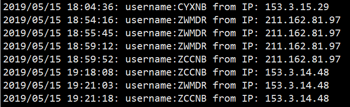

2. 聊天记录

   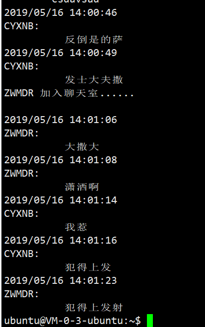

#### 1.9 服务器程序完整代码

```c
#include<stdio.h>   
#include<stdlib.h>
#include<sys/types.h> 
#include<sys/stat.h>
#include<netinet/in.h>  
#include<sys/socket.h> 
#include<string.h>
#include<unistd.h>
#include<signal.h>
#include<sys/ipc.h>
#include<errno.h>
#include<sys/shm.h>
#include<time.h>
#include<pthread.h>
#include<stdlib.h>
#include<arpa/inet.h>

#define PORT 1778
#define SIZE 1024
#define SIZE_SHMADD 2048
#define LISTEN_MAX 100

int listenfd;
int connfd[LISTEN_MAX];
int online_count;
FILE* record_log;
FILE* log_in_log;
struct tm *p_curtime;
time_t timep;

typedef struct users_info
{
	char name[32];
	char pswd[64];
	int log_status;
} users_info;

users_info* USERS;

//套接字描述符
int get_sockfd()
{
    struct sockaddr_in server_addr;
    if((listenfd=socket(AF_INET,SOCK_STREAM,0))==-1)
    {
        perror("socket");
        exit(-1);
    }
    printf("Socket successful!\n");
    //sockaddr结构 
    bzero(&server_addr,sizeof(struct sockaddr_in)); 
    server_addr.sin_family=AF_INET;                
    server_addr.sin_addr.s_addr=htonl(INADDR_ANY); 
    server_addr.sin_port=htons(PORT);  

    // 设置套接字选项避免地址使用错误，为了允许地址重用，我设置整型参数（on）为 1 （不然，可以设为 0 来禁止地址重用）
    int on=1;
    if((setsockopt(listenfd,SOL_SOCKET,SO_REUSEADDR,&on,sizeof(on)))<0)  
    {  
        perror("setsockopt failed");  
        exit(-1);
    }

    //绑定服务器的ip和服务器端口号
    if(bind(listenfd,(struct sockaddr *)(&server_addr),sizeof(struct sockaddr))==-1)     
    {
        perror("bind");
        exit(-1);   
    }
    printf("Bind successful!\n");
    //设置允许连接的最大客户端数
    if(listen(listenfd,LISTEN_MAX)==-1)
    {
        perror("bind");
        exit(-1); 
    }   
    printf("Listening.....\n");
    return listenfd;
}

void* pthread_handle(void * arg)
{
    unsigned int index;
	int i,k;
	int log_out_flag=0;
    index = *(unsigned int *)arg;
	k=0x0000FFFF&index;//该用户在用户信息数据库中的序号
	index=(0xFFFF0000&index)>>16;//该用户的线程序号
    printf("in pthread_recv,index = %d,connfd = %d\n",index,connfd[index]);
    char buffer[SIZE];
	char buff[SIZE];
	char time_ch[SIZE];
    while(1)
    {
        //用于接收信息
        memset(buffer,0,SIZE);
        if((recv(connfd[index],buffer,SIZE,0)) <= 0)
        {
			USERS[k].log_status=0;
            online_count=0;
			for(int ss=0;ss<LISTEN_MAX;ss++)
				if(USERS[ss].log_status)
					online_count++;

			memset(time_ch,0,SIZE);
			sprintf(time_ch,"SYS_SIGNAL_ONLINE_COUNT:%03d ",online_count);
			memset(buff,0,SIZE);
			time(&timep);
			p_curtime = localtime(&timep);
			strftime(buff, sizeof(buffer), "%Y/%m/%d %H:%M:%S\n", p_curtime);
			strcat(buff,"系统消息:\n\t");
			strcat(buff,USERS[k].name);
			strcat(buff,"已退出聊天室");
			printf("%s\n",buff);
			strcat(time_ch,buff);
			
			close(connfd[i]);
			connfd[index]=-1;
			log_out_flag=1;
        }
		else if(strncmp(buffer,"SYS_SIGNAL_IMG:",14)==0)//图片接收
		{
			printf("%s\n","Switch to img mode");
			char *p;
			char split[10][100]={0};
			const char *delim=":";
			int split_count=0;
			long count;
			char img_name[SIZE];
			p=strtok(buffer,delim);
			while(p)
			{
				strcpy(split[split_count++],p);
				p=strtok(NULL,delim);
			}
			memset(img_name,0,SIZE);
			memset(buff,0,SIZE);
			time(&timep);
			p_curtime = localtime(&timep);
			strftime(buff, sizeof(buff), "%Y_%m_%d_%H_%M_%S_", p_curtime);
			memset(buffer,0,SIZE);
			strcpy(img_name,"recv_imgs/");
			strcat(img_name,buff);
			strcat(img_name,split[1]);
			printf("img_name:%s\n",img_name);
			FILE *img=fopen(img_name,"wb");
			count=atol(split[2]);
			while(count>0)
			{
				memset(buffer,0,SIZE);
				long recv_len=recv(connfd[index],buffer,SIZE,0);
				fwrite(buffer,sizeof(char),recv_len,img);
				count-=recv_len;
			}
			fclose(img);
			
			//向用户转发图片
			struct stat statbuf;
			stat(img_name,&statbuf);
			count=statbuf.st_size;
			
			online_count=0;
			for(int ss=0;ss<LISTEN_MAX;ss++)
				if(USERS[ss].log_status)
					online_count++;

			memset(time_ch,0,SIZE);
			sprintf(time_ch,"SYS_SIGNAL_IMG:%s:%ld:",img_name,count);
			
			memset(buff,0,SIZE);
			time(&timep);
			p_curtime = localtime(&timep);
			strftime(buff, sizeof(buff), "%Y/%m/%d %H:%M:%S\n", p_curtime);
			strcat(buff,USERS[k].name);
			strcat(buff,":\n\t");
			strcat(buff,"发送了一张图片,已保存到程序目录下recv_imgs文件夹下");
			strcat(time_ch,buff);
			
			for(i = 0; i < LISTEN_MAX ; i++)
			{
				if(connfd[i] != -1)
				{
					if(send(connfd[i],time_ch,SIZE,0) == -1)
					{
						connfd[i]=-1;
					}
					if(connfd[i] != -1)
					{
						long send_count=count;
						img=fopen(img_name,"rb");
						while(send_count>0)
						{
							memset(buffer,0,SIZE);
							fread(buffer,sizeof(char),SIZE,img);
							long send_len=send(connfd[i],buffer,SIZE,0);
							send_count-=send_len;
							//usleep(2000);
						}
						fclose(img);
					}
				}
			}
			record_log=fopen("record.log","a+");
			printf(" %s\n",buff);
			fprintf(record_log,"%s\n",buff);
			fclose(record_log);
			
			//for(i = 0; i < LISTEN_MAX ; i++)
			{
				
			}
			continue;
		}
		else if(strncmp(buffer,"SYS_SIGNAL_FILE:",15)==0)//文件接收
		{
			char *p;
			char split[10][100]={0};
			const char *delim=":";
			int split_count=0;
			long count;
			char file_name[SIZE];
			p=strtok(buffer,delim);
			while(p)
			{
				strcpy(split[split_count++],p);
				p=strtok(NULL,delim);
			}
			memset(file_name,0,SIZE);
			memset(buff,0,SIZE);
			time(&timep);
			p_curtime = localtime(&timep);
			strftime(buff, sizeof(buff), "%Y_%m_%d_%H_%M_%S_", p_curtime);
			memset(buffer,0,SIZE);
			strcpy(file_name,"recv_files/");
			strcat(file_name,buff);
			strcat(file_name,split[1]);
			printf("file_name:%s\n",file_name);
			FILE *file=fopen(file_name,"wb");
			count=atol(split[2]);
			while(count>0)
			{
				memset(buffer,0,SIZE);
				long recv_len=recv(connfd[index],buffer,SIZE,0);
				fwrite(buffer,sizeof(char),recv_len,file);
				count-=recv_len;
			}
			fclose(file);
			
			//向用户转发文件
			struct stat statbuf;
			stat(file_name,&statbuf);
			count=statbuf.st_size;
			
			online_count=0;
			for(int ss=0;ss<LISTEN_MAX;ss++)
				if(USERS[ss].log_status)
					online_count++;

			memset(time_ch,0,SIZE);
			sprintf(time_ch,"SYS_SIGNAL_FILE:%s:%ld:",file_name,count);
			
			memset(buff,0,SIZE);
			time(&timep);
			p_curtime = localtime(&timep);
			strftime(buff, sizeof(buff), "%Y/%m/%d %H:%M:%S\n", p_curtime);
			strcat(buff,USERS[k].name);
			strcat(buff,":\n\t");
			strcat(buff,"发送了一份文件,已保存到程序目录下recv_files文件夹下\n文件名：");
			strcat(buff,file_name);
			strcat(time_ch,buff);
			
			for(i = 0; i < LISTEN_MAX ; i++)
			{
				if(connfd[i] != -1)
				{
					if(send(connfd[i],time_ch,SIZE,0) == -1)
					{
						connfd[i]=-1;
					}
				}
			}
			record_log=fopen("record.log","a+");
			printf(" %s\n",buff);
			fprintf(record_log,"%s\n",buff);
			fclose(record_log);
			
			for(i = 0; i < LISTEN_MAX ; i++)
			{
				if(connfd[i] != -1)
				{
					long send_count=count;
					file=fopen(file_name,"rb");
					while(send_count>0)
					{
						memset(buffer,0,SIZE);
						fread(buffer,sizeof(char),SIZE,file);
						long send_len=send(connfd[i],buffer,SIZE,0);
						send_count-=send_len;
						//usleep(2000);
					}
					fclose(file);
				}
			}
			continue;
		}
		else if(strncmp(buffer,"SYS_SIGNAL_EMOTION:",18)==0)//表情
		{
			char *p;
			char split[5][100]={0};
			const char *delim=":";
			int split_count=0;
			long count;
			char file_name[SIZE];
			p=strtok(buffer,delim);
			while(p)
			{
				strcpy(split[split_count++],p);
				p=strtok(NULL,delim);
			}
			char emoji[100];
			strcpy(emoji,split[1]);
			
			memset(buff,0,SIZE);
			time(&timep);
			p_curtime = localtime(&timep);
			strftime(buff, sizeof(buff), "%Y/%m/%d %H:%M:%S\n", p_curtime);
			strcat(buff,USERS[k].name);
			strcat(buff,":\n\t");
			strcat(buff,"向您发送了一个表情，该客户端暂不支持查看");
			
			memset(time_ch,0,SIZE);
			sprintf(time_ch,"SYS_SIGNAL_EMOTION:%s:%s",emoji,buff);
		}
		else if(strcmp(buffer,"SYS_SIGNAL_QUIT")==0)//用户退出
		{
			USERS[k].log_status=0;
			online_count=0;
			for(int ss=0;ss<LISTEN_MAX;ss++)
				if(USERS[ss].log_status)
					online_count++;

			memset(time_ch,0,SIZE);
			sprintf(time_ch,"SYS_SIGNAL_ONLINE_COUNT:%03d ",online_count);
			memset(buff,0,SIZE);
			time(&timep);
			p_curtime = localtime(&timep);
			strftime(buff, sizeof(buffer), "%Y/%m/%d %H:%M:%S\n", p_curtime);
			strcat(buff,"系统消息:\n\t");
			strcat(buff,USERS[k].name);
			strcat(buff,"已退出聊天室");
			printf("%s\n",buff);
			strcat(time_ch,buff);
			
			close(connfd[i]);
			connfd[index]=-1;
			log_out_flag=1;
			online_count--;
		}
		else//用户发送消息
		{
			online_count=0;
			for(int ss=0;ss<LISTEN_MAX;ss++)
				if(USERS[ss].log_status)
					online_count++;

			memset(time_ch,0,SIZE);
			sprintf(time_ch,"SYS_SIGNAL_ONLINE_COUNT:%03d ",online_count);
			
			memset(buff,0,SIZE);
			time(&timep);
			p_curtime = localtime(&timep);
			strftime(buff, sizeof(buff), "%Y/%m/%d %H:%M:%S\n", p_curtime);
			strcat(buff,USERS[k].name);
			strcat(buff,":\n\t");
			strcat(buff,buffer);
			strcat(time_ch,buff);
		}
		
		record_log=fopen("record.log","a+");
        printf(" %s\n",buff);
		fprintf(record_log,"%s\n",buff);
		fclose(record_log);
		
        for(i = 0; i < LISTEN_MAX ; i++)
        {
            if(connfd[i] != -1)
            {
                if(send(connfd[i],time_ch,SIZE,0) == -1)
                {
                    connfd[i]=-1;
                }
            }
        }
		if(log_out_flag)
		{
			pthread_exit(0);
		}
    }
}
void quit()  
{  
    char msg[10];
    int i = 0;
    while(1)
    {
        printf("please enter 'Q' to quit server!\n");
        scanf("%s",msg);  
        if(strcmp("Q",msg)==0)  
        {  
            printf("now close server\n");  
            close(listenfd); 
            for(i = 0; i < LISTEN_MAX ; i++)  
            {
                if(connfd[i] != -1)  
                {
                    close(connfd[i]);
                }
            }
            exit(0);  
        }  
    }
}

int main_main(int argc, char **argv)
//int main(int argc, char **argv)
{
    struct sockaddr_in client_addr;
    int sin_size;
    pid_t ppid,pid;
	FILE* fp;
	
	char construction[10];
	char name[32];
	char pswd[64];
	char* flag;
	
	USERS=(users_info*)malloc(LISTEN_MAX*sizeof(users_info));
	
	memset(construction,0,10);
	memset(name,0,32);
	memset(pswd,0,64);

	online_count=0;
    int num = 0,i = 0,ret;
    //线程标识号
    pthread_t thread_server_close,thread_handle;
    //unsigned char buffer[SIZE];
    char buffer[SIZE];
    //创建套接字描述符
    int listenfd = get_sockfd();
    //记录空闲的客户端的套接字描述符（-1为空闲）
	int full_flag=0;//线程已满
	
	//读取用户注册信息
	if((fp=fopen("log_in.ini","r"))==NULL)
	{
		exit(-1);
	}
	int count;
	fscanf(fp,"%d\n",&count);
	for(int k=0;k<count;k++)
	{
		char name[32],pswd[64];
		fscanf(fp,"%s\n",name);
		fscanf(fp,"%s\n",pswd);
		strcpy(USERS[k].name,name);
		strcpy(USERS[k].pswd,pswd);
		USERS[k].log_status=0;
	}
	fclose(fp);
	
	//密码及用户
    for(i = 0 ; i < LISTEN_MAX; i++)  
    {  
        connfd[i]=-1;
    }

    //创建一个线程，对服务器程序进行管理（关闭）
    ret = pthread_create(&thread_server_close,NULL,(void*)(&quit),NULL);
    if(ret != 0)
    {
        perror("Create pthread_handle fail!");
        exit(-1);
    }
    while(1)
    {
		int user_id;
        for(i=0;i < LISTEN_MAX;i++)
        {
            printf("i == %d\n",i);
            if(connfd[i]==-1)//表示套接字容器空闲，可用
            {
                break;
            }
        }
		if(i==LISTEN_MAX)
			full_flag=1;
		else
			full_flag=0;
        printf("before accept i == %d\n",i);
        //服务器阻塞,直到客户程序建立连接
        sin_size=sizeof(struct sockaddr_in);
		int conn;
        if((conn=accept(listenfd,(struct sockaddr *)(&client_addr),&sin_size))==-1)         
        {
            perror("accept");
            //exit(-1);
			continue;
        }
		
        printf("Accept successful!\n");
        printf("connect to client %d : %s:%d \n",num , inet_ntoa(client_addr.sin_addr), ntohs(client_addr.sin_port));
		
		//解析用户信息
		memset(buffer,0,SIZE);
		recv(conn,buffer,SIZE,0);
		strcpy(construction,buffer);
		memset(buffer,0,SIZE);
		strcpy(buffer,"OK");
		send(conn,buffer,SIZE,0);
		
		memset(buffer,0,SIZE);
		recv(conn,buffer,SIZE,0);
		strcpy(name,buffer);
		memset(buffer,0,SIZE);
		strcpy(buffer,"OK");
		send(conn,buffer,SIZE,0);
		printf("\nname:%s\n",name);
		
		memset(buffer,0,SIZE);
		recv(conn,buffer,SIZE,0);
		strcpy(pswd,buffer);
		printf("pswd:%s\n",pswd);
		
		if(full_flag)
		{
			memset(buffer,0,SIZE);
			strcpy(buffer,"error5");
			send(conn,buffer,SIZE,0);
			continue;
		}
		connfd[i]=conn;
		
		memset(buffer,0,SIZE);
		int judge=0;
		if(strcmp(construction,"log_in")==0)
		{
			for(int k=0;k<count;k++)
			{
				if(strcmp(name,USERS[k].name)==0)
				{
					judge=1;
					if(strcmp(pswd,USERS[k].pswd)==0)
					{
						judge=2;
						if(USERS[k].log_status==0)
						{
							USERS[k].log_status=1;
							user_id=k;
							judge=3;
							break;
						}
					}
					
				}
			}
			if(judge==0)
				strcpy(buffer,"error2");//无此用户信息，未注册
			else if(judge==1)
				strcpy(buffer,"error1");//密码错误
			else if(judge==2)
				strcpy(buffer,"error3");//重复登陆
			else if(judge==3)
				strcpy(buffer,"OK");//登录成功
			else
				strcpy(buffer,"ERROR");//未知错误
		}
		else//注册
		{
			judge = 3;
			memset(buffer, 0, SIZE);
			for (int k = 0; k < count; k++)
			{
				if (strcmp(name, USERS[k].name) == 0)
				{
					judge = 0;
					strcpy(buffer, "error4");
				}
			}
			if (judge != 0)
			{
				strcpy(USERS[count].name, name);
				strcpy(USERS[count].pswd, pswd);
				USERS[count].log_status = 1;
				user_id=count;
				count++;
				fp = fopen("log_in.ini", "w");
				fprintf(fp, "%d\n", count);
				for (int k = 0; k < count; k++)
				{
					fprintf(fp, "%s\n", USERS[k].name);
					fprintf(fp, "%s\n", USERS[k].pswd);
				}
				fclose(fp);
				strcpy(buffer, "OK1");
			}
		}
		send(connfd[i],buffer,SIZE,0);
		if (judge != 3)
		{
			connfd[i]=-1;
			continue;
		}
		memset(buffer,0,SIZE);
		recv(connfd[i],buffer,SIZE,0);
		if(strcmp(buffer,"OK")!=0)
			continue;

		online_count++;
		
		memset(buffer,0,SIZE);
		time(&timep);
        p_curtime = localtime(&timep);
        strftime(buffer, sizeof(buffer), "%Y/%m/%d %H:%M:%S: ", p_curtime);
		strcat(buffer,"username:");
		strcat(buffer,name);
		strcat(buffer," from IP: ");
		strcat(buffer,inet_ntoa(client_addr.sin_addr));
		
		log_in_log=fopen("log_in.log","a+");
		fprintf(log_in_log,"%s\n",buffer);
		fclose(log_in_log);
		
        //把界面发送给客户端
		
		online_count=0;
		for(int ss=0;ss<LISTEN_MAX;ss++)
			if(USERS[ss].log_status)
				online_count++;
		
        memset(buffer,0,SIZE);
		sprintf(buffer,"SYS_SIGNAL_ONLINE_COUNT:%03d ",online_count);
        strcat(buffer,"\n------------------------欢迎来到电子垃圾聊天室----------------------------\n");
		strcat(buffer,"\n--------------------------输入“Q”退出聊天室-------------------------------\n");
        send(connfd[i],buffer,SIZE,0);
		
        //将加入的新客户发送给所有在线的客户端/
        memset(buffer,0,SIZE);
		sprintf(buffer,"SYS_SIGNAL_ONLINE_COUNT:%03d ",online_count);
		
		strcpy(buffer,name);
        strcat( buffer," 加入聊天室......\n");
		record_log=fopen("record.log","a+");
		fprintf(record_log,"%s\n",buffer);
		fclose(record_log);
		
		online_count++;
        int j;
        for(j = 0; j < LISTEN_MAX; j++)
        {
            if(connfd[j] != -1)
            {
                printf("j == %d\n",j);
                send(connfd[j],buffer,strlen(buffer),0);
            }
        }
		unsigned int socked_index=i;
		socked_index=socked_index<<16 | (unsigned int)user_id;
        //int socked_index = i;//这里避免线程还未创建完成，i的值可能会被while循环修改
        //创建线程行读写操作
        ret = pthread_create(&thread_handle, NULL, pthread_handle, &socked_index);
		if(ret != 0)
		{
			perror("Create pthread_handle fail!");
			exit(-1);
		}
   }
   return 0;
}

void mydaemon(int ischdir, int isclose, int argc, char** argv)
{
	pid_t pid = fork();
	// 非子进程则退出
	if (pid != 0)
		exit(-1);
	pid = fork();

	// 非子进程则退出
	if (pid != 0)
		exit(-1);
	if (ischdir == 0)
	{
		chdir("/");
	}
	if (isclose == 0)
	{
		close(0);
		close(1);
		close(2);
	}
	//去掩码位
	umask((mode_t)0);//sys/stat.h
	main_main(argc, argv);
}

int main(int argc, char* argv[])
{
	mydaemon(1, 1, argc, argv);
	while (1);
	exit(EXIT_SUCCESS);
}

```

#### 1.10 版本控制

| 版本号 |    日期    |                修改                |
| :----: | :--------: | :--------------------------------: |
|  V1.0  | 2019/04/27 |          实现项目基本功能          |
|  V1.1  | 2019/04/30 |      优化用户异常退出处理方案      |
|  V1.2  | 2019/05/09 |        增加在线用户显示功能        |
|  V1.3  | 2019/05/14 | 实现图片的接收与存储（服务器接收） |
|  V1.4  | 2019/05/15 |   实现的图片的发送（服务器转发）   |
|  V1.5  | 2019/05/15 |          实现文件收发功能          |
|  V1.6  | 2019/05/16 |          实现表情收发功能          |
|  V2.0  | 2019/05/20 |      修复部分Bug，发布正式版       |

完整项目详见：[GitHub](<https://github.com/ZWMDR/chat_room>)


## 2. 客户端（命令行版本，不支持文件发送、图片或表情发送等操作）

#### 2.1 简介与预览

##### 2.1.1 简介

命令行版本客户端是项目开发早期为调试方便而开发的客户端，命令行客户端功能简单，稳定性较高，但不支持图片发送及显示、文件发送或emoji表情显示，但支持图片与文件的接收并转存，属轻量级应用。

##### 2.1.2 预览

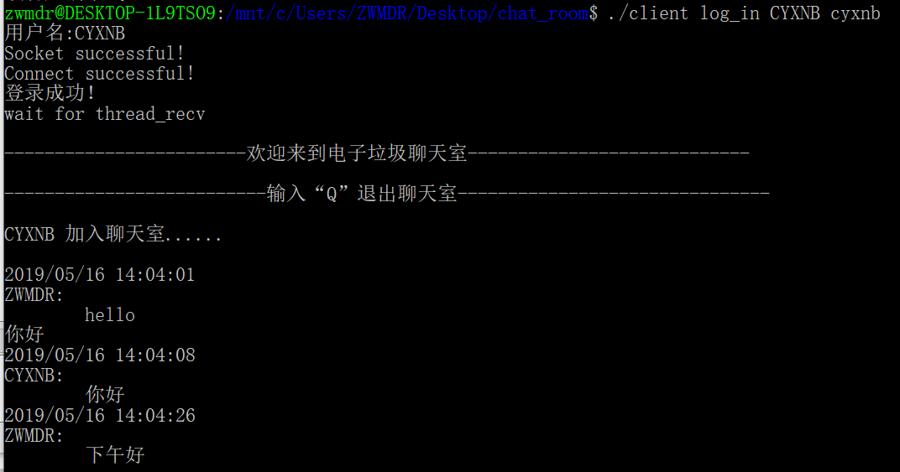

#### 2.2 开发环境

程序运行于本地基于Windows10子系统WSL的Ubuntu18.04；编程语言：C语言。

#### 2.3 程序架构

命令行版客户端程序同样采用多线程的方式实现。程序主线程负责接收用户的登录/注册信号、账号及密码，与服务器进行通信，最后得到登录信息，发聩给用户。登录成功后则创建两个子线程，分别用于接收服务器信息、接收键盘输入信息并发送。

#### 2.4 信息发送

受限于命令行窗口的限制，该版本的程序不支持图片、文件、表情的发送功能，仅支持基础的文本信息发送。

信息的发送由子线程函数实现：
```C
void* pthread_send(void * arg);
```
在该子线程中，程序接收用户从键盘键入的内容，并做出逻辑判断（是否为Q）后传入发送字符串中，由Socket函数：
```C
send(sockfd,buffer,SIZE,0);
```
发送至服务器。

发送部分的实现函数如下：
```C
void* pthread_send(void * arg)
{
    //时间函数
    char buffer[SIZE],buf[SIZE];
    int sockfd = *(int *)arg;

    while(1)
    {
        memset(buf,0,SIZE);
        fgets(buf,SIZE,stdin);//获取用户输入的信息
        memset(buffer,0,SIZE);


        /*对客户端程序进行管理*/
        if(strncmp("Q",buf,1)==0)
        {
            printf("该客户端下线...\n");
            strcpy(buffer,"SYS_SIGNAL_QUIT");
            if((send(sockfd,buffer,SIZE,0)) <= 0)
            {
                perror("error send");
            }
            close(sockfd);
            sockfd = -1;
            exit(0);
        }
        else
        {
			//printf("send");
            strncat(buffer,buf,strlen(buf)-1);
            if((send(sockfd,buffer,SIZE,0)) <= 0)
            {
                 perror("send");
            }
        }
    }
}
```

#### 2.4 信息接收

信息的接收由另一个子线程不断运行recv监听函数实现。程序在while(1)循环中不断执行监听操作，当服务器有信息传入时，首先解析信号头，根据不同信号头的含义做出响应操作。

信号头的含义如下：

| 信号头                  | 含义         | 操作 |
| :---------------------: | :----------: | ----------------------- |
| SYS_SIGNAL_ONLINE_COUNT | 当前在线人数 |过滤人数显示，只显示其后的文本信息|
| SYS_SIGNAL_IMG          | 发送图片 |接收文件，显示有图片完成传输，提醒用户到recv_imgs文件夹下查看；其具体实现方法与服务器端相同|
| SYS_SIGNAL_FILE | 发送文件 |接收文件，显示有文件完成传输，提醒用户到recv_files文件夹下查看；其具体实现方法与服务器端相同|
| SYS_SIGNAL_EMOTION | 发送表情 |提示无法显示表情内容|
| 无 | 系统信息 |直接显示|

对于该版本的客户端程序，无法显示图片或表情信息，因此当接收到表情信息时，不予显示，仅显示其后的系统信息；而对于图片和文件，程序仅完成接收并保存到本地文件夹，显示系统信息，但不予直接显示。具体接收的实现方式与服务器端相同。


#### 2.6 完整代码

```C
#include <stdio.h>
#include <netinet/in.h>  
#include <sys/socket.h> 
#include <sys/types.h>
#include <string.h>
#include <stdlib.h>
#include <netdb.h>
#include <unistd.h>
#include <signal.h>
#include <errno.h>
#include <time.h>
#include <pthread.h>

#define SIZE 1024
#define SEND_SIZE 106
#define SERV_PORT 1778
char name[32];
char pswd[64];

void* pthread_recv(void * arg)
{
    char buffer[SIZE];
	char buff[SIZE];
    int sockfd = *(int *)arg;
    while(1)
    {
        //用于接收信息
        memset(buffer,0,SIZE);
        if(sockfd > 0)
        {
            if((recv(sockfd,buffer,SIZE,0)) <= 0)
            {
                close(sockfd);
                exit(1);
            }
			if(strncmp(buffer,"SYS_SIGNAL_ONLINE_COUNT:",23)==0)
			{
				char* buf=buffer;
				printf("%s\n",buf+=28);
			}
			else if(strncmp(buffer,"SYS_SIGNAL_IMG:",14)==0)
			{
				int split_count=0;
				char *p;
				char split[10][100]={0};
				const char *delim=":";
				long count;
				char img_name[SIZE];
				p=strtok(buffer,delim);
				while(p)
				{
					strcpy(split[split_count++],p);
					//printf("%s\n",p);
					p=strtok(NULL,delim);
				}
				strcpy(img_name,split[1]);
				count=atol(split[2]);
				FILE *img=fopen(img_name,"wb");
				while(count>0)
				{
					memset(buffer,0,SIZE);
					long recv_len=recv(sockfd,buffer,SIZE,0);
					fwrite(buffer,sizeof(char),recv_len,img);
					count-=recv_len;
				}
				fclose(img);
				
				memset(buff,0,SIZE);
				for(int i=3;i<split_count;i++)
				{
					strcat(buff,split[i]);
					if(i<split_count-1)
						strcat(buff,":");
				}
				printf("%s\n",buff);
			}
			else if(strncmp(buffer,"SYS_SIGNAL_FILE:",15)==0)
			{
				int split_count=0;
				char *p;
				char split[10][100]={0};
				const char *delim=":";
				long count;
				char file_name[SIZE];
				p=strtok(buffer,delim);
				while(p)
				{
					strcpy(split[split_count++],p);
					//printf("%s\n",p);
					p=strtok(NULL,delim);
				}
				strcpy(file_name,split[1]);
				count=atol(split[2]);
				FILE *file=fopen(file_name,"wb");
				while(count>0)
				{
					memset(buffer,0,SIZE);
					long recv_len=recv(sockfd,buffer,SIZE,0);
					fwrite(buffer,sizeof(char),recv_len,file);
					count-=recv_len;
				}
				fclose(file);
				
				memset(buff,0,SIZE);
				for(int i=3;i<split_count;i++)
				{
					strcat(buff,split[i]);
					if(i<split_count-1)
						strcat(buff,":");
				}
				printf("%s\n",buff);
			}
			else if(strncmp(buffer,"SYS_SIGNAL_EMOTION:",18)==0)
			{
				int split_count=0;
				char *p;
				char split[10][100]={0};
				const char *delim=":";
				long count;
				char file_name[SIZE];
				p=strtok(buffer,delim);
				while(p)
				{
					strcpy(split[split_count++],p);
					//printf("%s\n",p);
					p=strtok(NULL,delim);
				}
				memset(buff,0,SIZE);
				for(int i=3;i<split_count;i++)
				{
					strcat(buff,split[i]);
					if(i<split_count-1)
						strcat(buff,":");
				}
				printf("%s\n",buff);
			}
			else
				printf("%s\n",buffer);
        }
    }

}
void* pthread_send(void * arg)
{
    //时间函数
    char buffer[SIZE],buf[SIZE];
    int sockfd = *(int *)arg;

    while(1)
    {
        memset(buf,0,SIZE);
        fgets(buf,SIZE,stdin);//获取用户输入的信息
        memset(buffer,0,SIZE);
        /*输出时间和客户端的名字*/

        /*对客户端程序进行管理*/
        if(strncmp("Q",buf,1)==0)
        {
            printf("该客户端下线...\n");
            strcpy(buffer,"SYS_SIGNAL_QUIT");
            if((send(sockfd,buffer,SIZE,0)) <= 0)
            {
                perror("error send");
            }
            close(sockfd);
            sockfd = -1;
            exit(0);
        }
        else
        {
			//printf("send");
            strncat(buffer,buf,strlen(buf)-1);
            if((send(sockfd,buffer,SIZE,0)) <= 0)
            {
                 perror("send");
            }
        }
    }
}
int main(int argc, char **argv)
{
    pid_t pid;
    int sockfd,confd;
    char buffer[SIZE],buf[SIZE];
	char sen_buff[SEND_SIZE];
	char name_recv[100],pswd_recv[100];
	char construction[10];
    struct sockaddr_in server_addr;
    struct sockaddr_in client_addr;
    struct hostent *host;
    short port;
	//0为已注册用户，直接登录
	//1为未注册用户，先行注册
	
    //线程标识号
    pthread_t thread_recv,thread_send;
    void *status;
    int ret;
	
	memset(name,0,32);
	memset(pswd,0,64);
    //四个参数
    if(argc!=4)
    {
        fprintf(stderr,"已注册用户请输入: \"%s+log_in+用户名+密码登录！\"\n",argv[0]);
		fprintf(stderr,"未注册用户请输入: \"%s+sign_in+用户名+密码登录！\"\n",argv[0]);
        exit(1);
    }
	host=gethostbyname("122.152.205.193");
	if(!(strcmp(argv[1],"log_in")==0 || strcmp(argv[1],"sign_in")==0))
	{
		perror("construction error");
        exit(-1);
	}
	stpcpy(construction,argv[1]);
    strcpy(name_recv,argv[2]);
	if(strlen(name_recv)>32)
	{
		perror("name nonconform");
        exit(-1);
	}
	else
		strcpy(name,name_recv);
	
    printf("用户名:%s\n",name);
	
	strcpy(pswd_recv,argv[3]);
	if(strlen(pswd_recv)>64)
	{
		perror("password nonconform");
        exit(-1);
	}
	strcpy(pswd,pswd_recv);
	
    /*客户程序开始建立 sockfd描述符 */
    if((sockfd=socket(AF_INET,SOCK_STREAM,0)) < 0) 
    {
        perror("socket");
        exit(-1);
    }
    printf("Socket successful!\n");

    /*客户程序填充服务端的资料 */
    bzero(&server_addr,sizeof(server_addr)); // 初始化,置0
    server_addr.sin_family=AF_INET;          // IPV4
    server_addr.sin_port=htons(SERV_PORT);  // (将本机器上的short数据转化为网络上的short数据)端口号
    server_addr.sin_addr=*((struct in_addr *)host->h_addr); // IP地址
    /* 客户程序发起连接请求 */
    if(connect(sockfd,(struct sockaddr *)(&server_addr),sizeof(struct sockaddr)) < 0) 
    {
        perror("connect");
        exit(-1); 
    }
    printf("Connect successful!\n");
	
    /*将用户信息发送到服务器端*/
	memset(buffer,0,SIZE);
	strcpy(buffer,construction);
	send(sockfd,buffer,SIZE,0);
	//printf("%s\n",buffer);
	memset(buffer,0,SIZE);
	recv(sockfd,buffer,SIZE,0);
	
	
	memset(buffer,0,SIZE);
	strcpy(buffer,name);
	send(sockfd,buffer,SIZE,0);
	//printf("%s\n",buffer);
	memset(buffer,0,SIZE);
	recv(sockfd,buffer,SIZE,0);
	
	
	memset(buffer,0,SIZE);
	strcpy(buffer,pswd);
    send(sockfd,buffer,SIZE,0);
	//printf("%s\n",buffer);
	
	
	//接收登录成功信息
	memset(buffer,0,SIZE);
	recv(sockfd,buffer,SIZE,0);
	if(strcmp(buffer,"error1")==0)
	{
		printf("密码错误，请重试！\n");
		exit(-1);
	}
	else if(strcmp(buffer,"error2")==0)
	{
		printf("用户未注册，请先注册！\n");
		exit(-1);
	}
	else if(strcmp(buffer,"erroe3")==0)
	{
		printf("用户已登录，请勿重复登陆！\n");
		exit(-1);
	}
	else if(strcmp(buffer,"error4")==0)
	{
		printf("账号已存在，请勿重复注册！\n");
		exit(-1);
	}
	else if(strcmp(buffer,"error5")==0)
	{
		printf("聊天室人数已达上限，请稍后重试！\n");
		exit(-1);
	}
	else
	{
		if(strcmp(buffer,"OK")==0)
		{
			printf("登录成功！\n");
		}
		else if(strcmp(buffer,"OK1")==0)
		{
			printf("注册成功！已自动登录\n");
		}
		else
		{
			printf("未知网络错误，请重试！\n");
			exit(-1);
		}
	}
	memset(buffer,0,SIZE);
	strcpy(buffer,"OK");
	send(sockfd,buffer,SIZE,0);
	
    //创建线程行读写操作/
    ret = pthread_create(&thread_recv, NULL, pthread_recv, &sockfd);//用于接收信息
    if(ret != 0)
    {
        perror("Create thread_recv fail!");
        exit(-1);
    }
    ret = pthread_create(&thread_send, NULL, pthread_send, &sockfd);//用于发送信息
    if(ret != 0)
    {
        perror("Create thread_send fail!");
        exit(-1);
    }
    printf("wait for thread_recv \n");
    pthread_join(thread_recv, &status);
    printf("wait for thread_send \n");
    pthread_join(thread_send, &status);
    printf("close sockfd \n");
    close(sockfd);
    return 0;    
}
```

#### 2.7 版本控制

| 版本号 | 时间 | 修改 |
| :----: | :--: | :--: |
|  V1.0  | 2019/04/27 |   实现项目基本功能V1.0   |
|  V1.4  | 2019/05/15 |     实现的图片的接收     |
|  V1.5  | 2019/05/15 |     实现文件接收功能     |
|  V1.6  | 2019/05/16 |     实现表情接收功能     |
|  V2.0  | 2019/05/20 | 修复部分Bug，发布正式版 |

完整项目详见：[GitHub](<https://github.com/ZWMDR/chat_room>)


## 3. 客户端（GUI版本，完整功能）

### 3.1 简介

为了能够直观、方便地实现表情、图片及文件的传输，我还使用Qt开发GUI版客户端作为本项目的重点开发程序，可实现本项目的所有预设功能。

### 3.2 开发环境

GUI版本程序主要使用Windows 64位版Qt5.9.8开发，使用MinGW5.3.0编译；同时程序也在64位Ubuntu16.04操作系统Qt5.9.8客户端中使用GCC编译通过，可实现跨平台编译。

程序主要使用C++语言编写，辅以少量C语言及QMake。

### 3.3 程序架构

程序包含两个主要界面和一个辅助界面，分别为：登录界面、聊天主界面和表情选择界面。

具体逻辑关系如下：

#### 3.3.1 登陆界面

```flow
st=>start: 程序启动
run=>operation: 显示Log_in登录界面
autofill=>condition: 是否存在config.ini配置文件？
input=>operation: 输入用户名、密码
fill=>operation: 自动填充
verify=>operation: 服务器通信
_verify=>condition: 登陆是否成功？
log_in=>end: 用户登录，调用聊天室主界面Chat_Window
hint=>operation: 错误提示

st->run->autofill
autofill(no)->input
autofill(yes)->fill
fill->input
input->verify
verify->_verify
_verify(yes)->log_in
_verify(no)->hint->input
```


#### 3.3.2 聊天室主界面框架

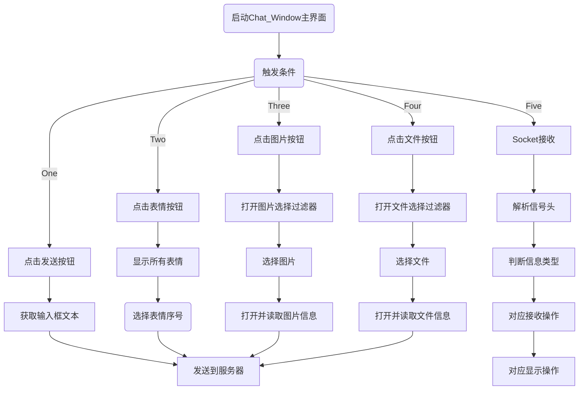


### 3.4 TCP连接与收发

为方便跨平台编译，这里使用Qt的库函数：QTcpsocket，通过将socket封装在**class**  *ip_info*中，实现在不同界面之间传递。

对**ip_info**的初始化，这里重载了两个初始化函数，以便于一些后续的改进。

```C++
class IP_info
{
public:
    IP_info(unsigned short port)
    {
        IP_addr="122.152.205.193";
        IP_port=port;
        connected=false;
        sended=false;
        recved=false;
        socket=new QTcpSocket();
    }
    IP_info()
    {
        IP_addr="122.152.205.193";
        IP_port=1778;
        connected=false;
        sended=false;
        recved=false;
        socket=new QTcpSocket();
    }
private:
    std::string IP_addr;
    unsigned short IP_port;
public:
    bool connected;
    bool sended;
    bool recved;
    QTcpSocket *socket;
};
```

在“登录“按钮触发的槽函数中，通过函数：

```C++
IP->socket->connectToHost(IP->IP_addr.c_str(), IP->IP_port);
```

建立TCP连接，并使用函数：

```C++
IP->connected=IP->socket->waitForConnected(2000);
```

判断连接是否成功建立，否则提示网络错误。

```C++
if(!IP->connected)
{
	QMessageBox msg;
	msg.setWindowTitle("提示");
    msg.setText("连接超时，请稍后重试！");
	msg.setStyleSheet("font: 8pt;");
	msg.setIcon((QMessageBox::Information));
	msg.addButton(tr("确定"),QMessageBox::ActionRole);
	msg.exec();
	return false;
}
```

效果如下：

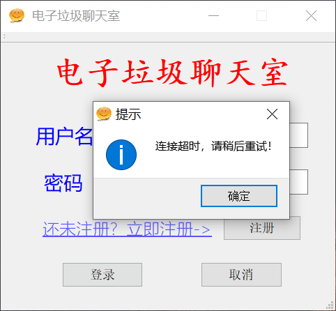


信息的收发依靠QTcpSocket类中：

```c++
size_t QTcpSocket::read(char* buffer, size_t size);
size_t QTcpSocket::write(char* buffer,size_t size);
```

函数实现收发，通过：

```C++
bool QTcpSocket::waitForBytesWritten(int msec=30000);
bool QTcpSocket::waitForReadyRead(int msec=30000);
```

函数等待确定TCP收发操作已完成。


### 3.5 主界面

程序共有两个主界面，和一个表情显示界面。

#### 3.5.1 登录界面

##### 3.5.1.1 界面预览

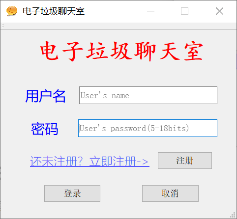

##### 3.5.1.2 登录流程

当程序运行时，首先会在程序目录下寻找写有历史登录信息的config.ini配置文件，若成功找到则会自动补充，若没有找到则不会。用户输入的密码长度至少为5位，最多位18位，若密码长度不符合要求则会提示重新输入。

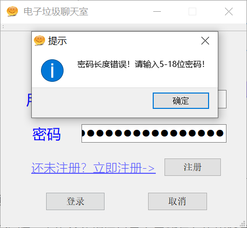

用户输入用户名或密码后，可直接点击“登录”按钮或敲“回车”键实现登录，此时程序将从输入框读取文本信息，并于服务器通信，用户信息匹配成功后返回成功登录。

对于未注册用户，可直接输入符合要求的用户名及密码，点击“注册按钮”，注册成功直接登录。

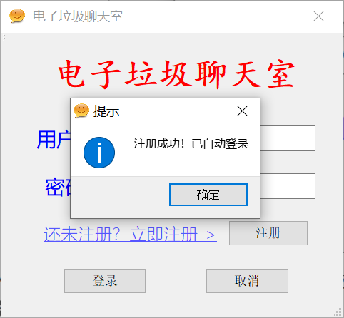

注册时不允许重名，否则会提示用户名重复，拒绝注册请求。

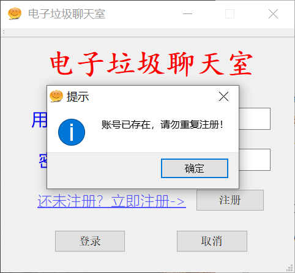


若登录过程中，出现重复登录或密码错误的情况，系统也会给出相应提示。

#### 3.5.2 聊天室主界面

登录成功后，随即进入到聊天室主界面。主界面左上方在聊天室后会显示当前用户名，以便查看。

在界面的最上方还会显示当前系统在线人数，并实时更新。

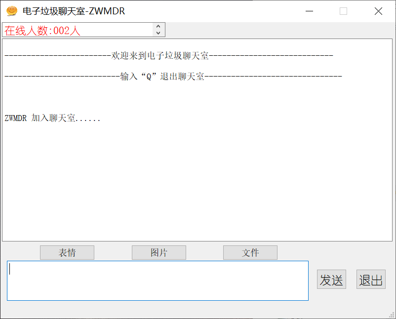


主界面程序中充分应用Qt的槽函数机制，将TCPSocket的读取信号与程序信息接收函数绑定，由此可不使用多线程方式实现信息的收发。

```C++
QObject::connect(IP->socket,&QTcpSocket::readyRead,this,&Chat_Window::socket_recv);
```

> 其中，void Chat_Window::socket_recv( ) 函数即为信息处理函数

#### 3.5.3 表情选择框

程序内置64中常用表情，通过自定义特殊编码方式实现快速收发，节省系统资源。

当鼠标点击“表情”按钮时，触发槽函数，槽函数中调用第三个主界面函数，从emotions文件夹下依次读取并显示出全部内置表情，效果如下图所示。

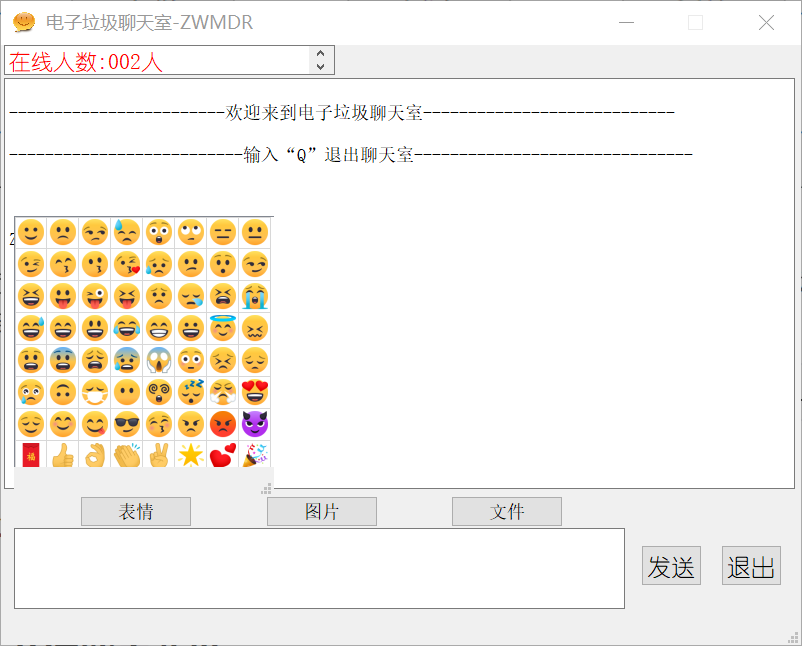


表情图片加载函数如下：

```C++
void Emoji::addEmoji(QString path)
{
    this->setWindowFlags(Qt::FramelessWindowHint | Qt::WindowStaysOnTopHint);
    ui->tableWidget->setFocusPolicy(Qt::NoFocus);

    for(int i=0;i<8;i++)
        for(int j=0;j<8;j++)
        {
            QTableWidgetItem* tableWidgetItem = new QTableWidgetItem;
            this->ui->tableWidget->setItem(j,i,tableWidgetItem);

            QLabel *emoji_icon=new QLabel();
            emoji_icon->setMargin(2);
            QImage *img=new QImage();
            img->load(path.arg(i+8*j+1));
            QPixmap pixmap = QPixmap::fromImage(*img);
            QPixmap fitpixmap = pixmap.scaled(28, 28, Qt::KeepAspectRatio, Qt::SmoothTransformation);  // 按比例缩放
            emoji_icon->setPixmap(fitpixmap);
            this->ui->tableWidget->setCellWidget(j,i,emoji_icon);
        }
}
```


### 3.6 普通消息收发


### 3.7 emoji表情

同样通过槽函数机制，当鼠标点击TableWidget中的表情图样时，触发槽函数，根据所点击的图标坐标定位到表情编码，并添加表情信号头后发送至服务器，实现发送。

```C++
void Emoji::on_tableWidget_cellClicked(int row, int column)
{
    std::cout<<"row="<<row<<" column="<<column<<std::endl;
    QString mesg="SYS_SIGNAL_EMOTION:%1.png";
    char buffer[SIZE];
    strcpy(buffer,mesg.arg(column+1+8*row).toStdString().c_str());
    this->IP->socket->write(buffer,SIZE);
    this->IP->sended=this->IP->socket->waitForBytesWritten(2000);
    this->close();
}
```


接收时，在信息接收函数void Chat_Window::socket_recv()中，通过解析信号头是否为“SYS_SIGNAL_EMORION“ 判断是否为表情信息，是则通过如下字符串切片函数提取出表情编号，再从本地emotions文件夹中加载对应编号的表情图片显示到消息框中。

```C++
else if(strncmp(buffer,"SYS_SIGNAL_EMOTION:",18)==0)
{
	QString cmd=buffer;
	QStringList cmd_split=cmd.split(":");
	QString emoji=cmd_split[1];
	QString msg;
	for(int i=2;i<cmd_split.length()-1;i++)
	{
		msg+=cmd_split[i];
		msg+=":";
	}
	QString path="emotions\\"+emoji;
	QTextDocumentFragment fragment;
	this->ui->output->append(msg+"\n");
	fragment = QTextDocumentFragment::fromHtml("");
	this->ui->output->textCursor().insertFragment(fragment);
	this->ui->output->setVisible(true);
}
```

效果如下图所示：

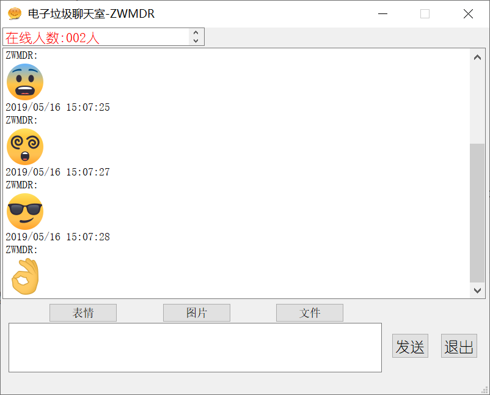


### 3.8 图片/文件收发

#### 3.8.1 图片发送

连接“图片”按钮与对应的处理槽函数，当按钮被点击时调出图片选择过滤器。


选中相应图片后，选择框返回所选图片的绝对路径：

```C++
QFileDialog *fileDialog=new QFileDialog(this);
fileDialog->setWindowTitle(tr("选择要发送的图片"));
fileDialog->setDirectory(".");
fileDialog->setNameFilter(tr("Images(*.png *.jpg *.jpeg *.bmp)"));
fileDialog->setFileMode(QFileDialog::ExistingFiles);
fileDialog->setViewMode(QFileDialog::Detail);
QStringList fileNames;
if(fileDialog->exec())
{
	fileNames = fileDialog->selectedFiles();
}
```

获取了图片路径后，接下来要先获取图片的大小信息，对其大小做一个限制，不能超过5MB：

```C++
QFileInfo info(tmp);
qint64 img_size=info.size();//字节
std::cout<<"img_size="<<(QString::number(img_size/1024.0,10,2)+"KB,").toStdString()<<std::endl;
if(img_size/1024/1024>5)//最大不超过5MB
{
	QMessageBox msg;
	msg.setWindowTitle("提示");
	QString mesg="所选图片大小为:"+QString::number(img_size/1024.0,10,2)+"KB,"+"图片太大无法发送!";
	msg.setText(mesg);
	msg.setStyleSheet("font: 8pt;");
	msg.setIcon((QMessageBox::Information));
	msg.addButton(tr("确定"),QMessageBox::ActionRole);
	msg.exec();
	continue;
}
```

最后根据图片大小，多次循环发送图片到服务器端：

```C++
clear_buf(buffer);
strcpy(buffer,"SYS_SIGNAL_IMG:");//系统图片发送信号
strcat(buffer,(im_name+":").toStdString().c_str());//图片名
strcat(buffer,QString::number(img_size,10).toStdString().c_str());//发送字节数
counts=img_size;
IP->socket->write(buffer,SIZE);
IP->socket->waitForBytesWritten(2000);
while(counts>0)
{
	clear_buf(buffer);
	file.read(buffer,SIZE);
	qint64 send_len=this->IP->socket->write(buffer,SIZE);
	this->IP->sended=this->IP->socket->waitForBytesWritten(1000);
	counts-=send_len;
}
file.close();
```


#### 3.8.2 图片接收

图片的接收同样通过信息处理槽函数提取分析信号头，再循环接收。具体实现过程与上文中所提到的方式相同，此处不再赘述。

GUI版本相比命令行版本程序可直接显示接收的图片。

对于图片尺寸差异，在这里我将图片按照其大小进行缩放。

- 对于图片宽度超过640像素的图片，将图片的宽度压缩至640，同时高度也按比例压缩；

- 而若图片宽度介于320-640之间，则将其等比例压缩至320像素；

- 对于像素宽度小于320像素的图片，不予压缩，直接显示。

具体操作如下：  

```C++
else if(strncmp(buffer,"SYS_SIGNAL_IMG:",14)==0)
{
	QString cmd=buffer;
	QStringList cmd_split=cmd.split(":");
	qint64 counts=cmd_split[2].toLong();
	std::cout<<"counts="<<counts<<std::endl;
	QString img_name=cmd_split[1];
	QFile img(img_name);
	img.open(QIODevice::WriteOnly);
	std::cout<<"img opened"<<std::endl;
	QObject::disconnect(IP->socket,&QTcpSocket::readyRead,this,&Chat_Window::socket_recv);
	while(counts>0)
	{
	clear_buf(buffer);
	IP->recved=IP->socket->waitForReadyRead(1);
	qint64 recv_len=this->IP->socket->read(buffer,SIZE);
	img.write(buffer,recv_len);
	counts-=recv_len;
	}
    img.close();
    QString msg;
    for(int i=3;i<cmd_split.length()-1;i++)
    {
		msg+=cmd_split[i];
		msg+=":";
    }
    this->ui->output->append(msg+"\n");
    QImage image;
    image.load(img_name);
    int w=image.width();
    int h=image.height();
    QTextDocumentFragment fragment;
    if(w>640)
    {
        double scale_rate=640.0/w;
        w=640;
        h*=scale_rate;
    }
    else if(w>320)
    {
        double scale_rate=320.0/w;
        h*=scale_rate;
        w=320;
    }
    fragment = QTextDocumentFragment::fromHtml("");
    this->ui->output->textCursor().insertFragment(fragment);
    this->ui->output->setVisible(true);
    this->IP->socket->readAll();
    QObject::connect(IP->socket,&QTcpSocket::readyRead,this,&Chat_Window::socket_recv);
}
```

#### 3.8.3 文件收发

文件收发操作与上文图片收发类似，区别在于图片不予显示，仅提示保存目录与文件名。

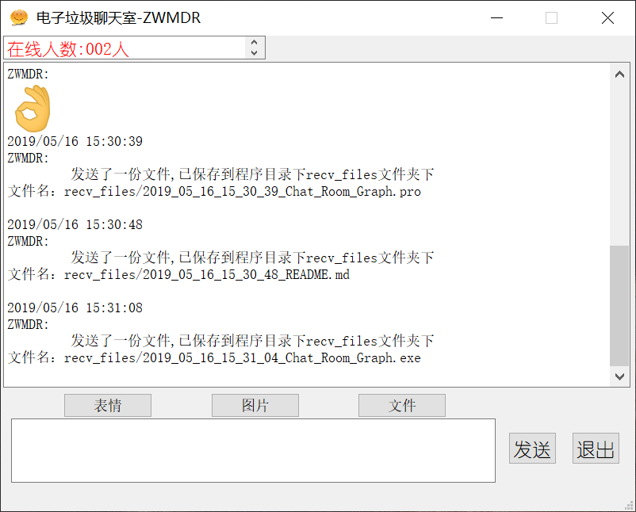


### 3.9 核心代码展示

#### Chat_Room_Graph.pro

```
#-------------------------------------------------
#
# Project created by QtCreator 2019-04-29T19:21:43
#
#-------------------------------------------------

QT       += core gui
QT       += network

greaterThan(QT_MAJOR_VERSION, 4): QT += widgets

TARGET = Chat_Room_Graph
TEMPLATE = app

# The following define makes your compiler emit warnings if you use
# any feature of Qt which has been marked as deprecated (the exact warnings
# depend on your compiler). Please consult the documentation of the
# deprecated API in order to know how to port your code away from it.
DEFINES += QT_DEPRECATED_WARNINGS

# You can also make your code fail to compile if you use deprecated APIs.
# In order to do so, uncomment the following line.
# You can also select to disable deprecated APIs only up to a certain version of Qt.
#DEFINES += QT_DISABLE_DEPRECATED_BEFORE=0x060000    # disables all the APIs deprecated before Qt 6.0.0

CONFIG += c++11

SOURCES += \
        main.cpp \
        log_in.cpp \
    chat_window.cpp \
    emoji.cpp

HEADERS += \
        log_in.h \
    chat_window.h \
    ip_info.h \
    emoji.h

FORMS += \
        log_in.ui \
    chat_window.ui \
    emoji.ui

# Default rules for deployment.
qnx: target.path = /tmp/$${TARGET}/bin
else: unix:!android: target.path = /opt/$${TARGET}/bin
!isEmpty(target.path): INSTALLS += target

RC_ICONS=Logo/1.ico

```

#### main.cpp

```C++
#include "log_in.h"
#include <QApplication>

int main(int argc, char *argv[])
{
    QApplication a(argc, argv);
    IP_info *IP=new IP_info();
    Log_in log_in;
    log_in.IP_assign(IP);
    log_in.setWindowTitle(" 电子垃圾聊天室");
    log_in.show();

    return a.exec();
}
```

#### ip_info.h

```C++
#ifndef IP_INFO_H
#define IP_INFO_H
#include <QTcpSocket>
#include <string>
#include <iostream>

class IP_info
{
public:
    IP_info(unsigned short port)
    {
        IP_addr="122.152.205.193";
        IP_port=port;
        connected=false;
        sended=false;
        recved=false;
        socket=new QTcpSocket();
    }
    IP_info()
    {
        IP_addr="122.152.205.193";
        IP_port=1778;
        connected=false;
        sended=false;
        recved=false;
        socket=new QTcpSocket();
    }

    std::string IP_addr;
    unsigned short IP_port;
    bool connected;
    bool sended;
    bool recved;
    QTcpSocket *socket;
};
#endif // IP_INFO_H

```

#### log_in.h

```C++
#ifndef LOG_IN_H
#define LOG_IN_H

#include <QMainWindow>
#include <QTcpSocket>
#include <string>
#include <QMessageBox>
#include <iostream>
#include <QDebug>
#include <string.h>
#include "ip_info.h"
#include <fstream>

namespace Ui {
class Log_in;
}

class Log_in : public QMainWindow
{
    Q_OBJECT

public:
    explicit Log_in(QWidget *parent = nullptr);
    void IP_assign(IP_info *IP);
    ~Log_in();

private slots:
    void on_Log_in_but_clicked();

    void on_cancel_but_clicked();

    void on_sign_in_but_clicked();

    void on_user_name_returnPressed();

    void on_user_pswd_returnPressed();

private:
    Ui::Log_in *ui;
    IP_info *IP;
    int lst_input_count;
    char *buffer;
    bool user_config_exist;
    QString user_name;
    QString user_pswd;
    bool _config_;

    bool log_communicate(std::string);
    bool file_open();
    bool file_write(QString name,QString pswd);
};

#endif // LOG_IN_H
```

#### log_in.cpp

```C++
#include "log_in.h"
#include "ui_log_in.h"
#include "chat_window.h"

#define SIZE 1024

using namespace std;

void network_error()
{
    QMessageBox msg;
    msg.setWindowTitle("提示");
    msg.setText("网络错误，请稍后重试！");
    msg.setStyleSheet("font: 8pt;");
    msg.setIcon((QMessageBox::Information));
    msg.exec();
}

Log_in::Log_in(QWidget *parent) :
    QMainWindow(parent),
    ui(new Ui::Log_in)
{
    ui->setupUi(this);
    lst_input_count=0;
    buffer=new char[SIZE];
    this->_config_=file_open();
}

void Log_in::IP_assign(IP_info *IP)
{
    this->IP=IP;
}

Log_in::~Log_in()
{
    delete ui;
}

bool Log_in::file_open()
{
    std::ifstream config_file;
    try
    {
        config_file.open("config.ini",ios::in);
    }
    catch(std::exception &e)
    {
        std::cout<<e.what()<<std::endl;
        config_file.close();
        return false;
    }
    std::string name,pswd;
    config_file>>name;
    config_file>>pswd;
    this->ui->user_name->setText(name.c_str());
    this->ui->user_pswd->setText(pswd.c_str());
    config_file.close();
    return true;
}

bool Log_in::file_write(QString name, QString pswd)
{
    std::ofstream config_file;
    config_file.open("config.ini",ios::out);
    config_file<<name.toStdString()<<std::endl;
    config_file<<pswd.toStdString()<<std::endl;
    config_file.close();
    return true;
}

bool Log_in::log_communicate(std::string construction)
{
    QString name=this->ui->user_name->text();
    QString pswd=this->ui->user_pswd->text();
    if(pswd.length()<5 || pswd.length()>18)
    {
        QMessageBox msg;
        msg.setWindowTitle("提示");
        msg.setText("密码长度错误！请输入5-18位密码！");
        msg.setStyleSheet("font: 8pt;");
        msg.setIcon((QMessageBox::Information));
        msg.addButton(tr("确定"),QMessageBox::ActionRole);
        msg.exec();
        return false;
    }
    this->user_name=name;
    this->user_pswd=pswd;
    //打开TCP连接
    IP->socket->connectToHost(IP->IP_addr.c_str(), IP->IP_port);
    IP->connected=IP->socket->waitForConnected(2000);
    if(!IP->connected)
    {
        QMessageBox msg;
        msg.setWindowTitle("提示");
        msg.setText("连接超时，请稍后重试！");
        msg.setStyleSheet("font: 8pt;");
        msg.setIcon((QMessageBox::Information));
        msg.addButton(tr("确定"),QMessageBox::ActionRole);
        msg.exec();
        return false;
    }

    //发送登录信息
    memset(buffer,0,SIZE);
    strcpy(buffer,construction.c_str());
    IP->socket->write(buffer,SIZE);
    IP->sended=IP->socket->waitForBytesWritten(2000);
    if(!IP->sended)
    {
        network_error();
        return false;
    }
    memset(buffer,0,SIZE);
    IP->recved=IP->socket->waitForReadyRead(2000);
    if(!IP->recved)
    {
        network_error();
        return false;
    }
    IP->socket->read(buffer,SIZE);

    memset(buffer,0,SIZE);
    strcpy(buffer,name.toStdString().c_str());
    IP->socket->write(buffer,SIZE);
    IP->sended=IP->socket->waitForBytesWritten(2000);
    if(!IP->sended)
    {
        network_error();
        return false;
    }
    memset(buffer,0,SIZE);
    IP->recved=IP->socket->waitForReadyRead(2000);
    if(!IP->recved)
    {
        network_error();
        return false;
    }
    IP->socket->read(buffer,SIZE);
    memset(buffer,0,SIZE);
    strcpy(buffer,pswd.toStdString().c_str());

    IP->socket->write(buffer,SIZE);
    IP->sended=IP->socket->waitForBytesWritten(2000);
    if(!IP->sended)
    {
        network_error();
        return false;
    }

    //接收登录信息
    memset(buffer,0,SIZE);
    IP->recved=IP->socket->waitForReadyRead(2000);
    if(!IP->recved)
    {
        network_error();
        return false;
    }
    IP->socket->read(buffer,SIZE);

    cout<<buffer<<endl;
    if(strcmp(buffer,"error1")==0)
    {
        QMessageBox msg;
        msg.setWindowTitle("提示");
        msg.setText("密码错误，请重试！");
        msg.setStyleSheet("font: 8pt;");
        msg.setIcon((QMessageBox::Information));
        msg.addButton(tr("确定"),QMessageBox::ActionRole);
        msg.exec();
        return false;
    }
    else if(strcmp(buffer,"error2")==0)
    {
        QMessageBox msg;
        msg.setWindowTitle("提示");
        msg.setText("用户未注册，请先注册账户！");
        msg.setStyleSheet("font: 8pt;");
        msg.setIcon((QMessageBox::Information));
        msg.addButton(tr("确定"),QMessageBox::ActionRole);
        msg.exec();
        return false;
    }
    else if(strcmp(buffer,"error3")==0)
    {
        QMessageBox msg;
        msg.setWindowTitle("提示");
        msg.setText("用户已登陆，请勿重复登录！");
        msg.setStyleSheet("font: 8pt;");
        msg.setIcon((QMessageBox::Information));
        msg.addButton(tr("确定"),QMessageBox::ActionRole);
        msg.exec();
        return false;
    }
    else if(strcmp(buffer,"error4")==0)
    {
        QMessageBox msg;
        msg.setWindowTitle("提示");
        msg.setText("账号已存在，请勿重复注册！");
        msg.setStyleSheet("font: 8pt;");
        msg.setIcon((QMessageBox::Information));
        msg.addButton(tr("确定"),QMessageBox::ActionRole);
        msg.exec();
        return false;
    }
    else if(strcmp(buffer,"error5")==0)
    {
        QMessageBox msg;
        msg.setWindowTitle("提示");
        msg.setText("聊天室人数已达上限，请稍后重试！");
        msg.setStyleSheet("font: 8pt;");
        msg.setIcon((QMessageBox::Information));
        msg.addButton(tr("确定"),QMessageBox::ActionRole);
        msg.exec();
        return false;
    }
    else
    {
        if(strcmp(buffer,"OK")==0)
        {
            return true;
        }
        else if(strcmp(buffer,"OK1")==0)
        {
            QMessageBox msg;
            msg.setWindowTitle("提示");
            msg.setText("注册成功！已自动登录");
            msg.setStyleSheet("font: 8pt;");
            msg.setIcon((QMessageBox::Information));
            msg.addButton(tr("确定"),QMessageBox::ActionRole);
            msg.exec();
            return true;
        }
        else
        {
            QMessageBox msg;
            msg.setWindowTitle("提示");
            msg.setText("未知网络错误，请稍后重试！");
            msg.setStyleSheet("font: 8pt;");
            msg.setIcon((QMessageBox::Information));
            msg.addButton(tr("确定"),QMessageBox::ActionRole);
            msg.exec();
            return false;
        }
    }
}

void Log_in::on_Log_in_but_clicked()//登录按钮
{
    std::string construction="log_in";
    if(!log_communicate(construction))
    {
        IP->socket->close();
        IP->socket->reset();
        return;
    }
    memset(buffer,0,SIZE);
    strcpy(buffer,"OK");
    IP->socket->write(buffer,SIZE);
    IP->sended=IP->socket->waitForBytesWritten(2000);
    if(!IP->sended)
    {
        network_error();
        IP->socket->close();
        IP->socket->reset();
        return;
    }
    file_write(this->user_name,this->user_pswd);
    Chat_Window *chat_window=new Chat_Window();
    chat_window->setWindowTitle(" 电子垃圾聊天室-"+user_name);
    chat_window->IP_assign(IP);
    chat_window->show();
    this->close();
}

void Log_in::on_cancel_but_clicked()//取消按钮
{
    this->close();
}

void Log_in::on_sign_in_but_clicked()//注册按钮
{
    std::string construction="sign_in";
    if(!log_communicate(construction))
    {
        IP->socket->close();
        IP->socket->reset();
        return;
    }
    memset(buffer,0,SIZE);
    strcpy(buffer,"OK");
    IP->socket->write(buffer,SIZE);
    IP->sended=IP->socket->waitForBytesWritten(2000);
    if(!IP->sended)
    {
        network_error();
        IP->socket->close();
        IP->socket->reset();
        return;
    }
    Chat_Window *chat_window=new Chat_Window();
    chat_window->setWindowTitle(" 电子垃圾聊天室-"+user_name);
    chat_window->IP_assign(IP);
    chat_window->show();
    this->close();
}

void Log_in::on_user_name_returnPressed()
{
    QString name=this->ui->user_name->text();
    QString pswd=this->ui->user_pswd->text();
    if(name.length()==0)
    {
        QMessageBox msg;
        msg.setWindowTitle("提示");
        msg.setText("请输入账号！");
        msg.setStyleSheet("font: 8pt;");
        msg.setIcon((QMessageBox::Information));
        msg.addButton(tr("确定"),QMessageBox::ActionRole);
        msg.exec();
    }
    else if(pswd.length()==0)
    {
        QMessageBox msg;
        msg.setWindowTitle("提示");
        msg.setText("请输入密码！");
        msg.setStyleSheet("font: 8pt;");
        msg.setIcon((QMessageBox::Information));
        msg.addButton(tr("确定"),QMessageBox::ActionRole);
        msg.exec();
    }
    else {
        on_Log_in_but_clicked();
    }
}

void Log_in::on_user_pswd_returnPressed()
{
    on_user_name_returnPressed();
}
```

#### chat_window.h

```C++
#ifndef CHAT_WINDOW_H
#define CHAT_WINDOW_H

#include <QMainWindow>
#include <QFile>
#include "ip_info.h"
#include "log_in.h"
#include "emoji.h"

#define SIZE 1024

namespace Ui {
class Chat_Window;
}

class Chat_Window : public QMainWindow
{
    Q_OBJECT

public:
    explicit Chat_Window(QWidget *parent = nullptr);
    ~Chat_Window();
    void IP_assign(IP_info *IP);

private slots:
    void on_send_bwt_clicked();

    void on_cancel_bwt_clicked();

    void on_file_btn_clicked();

    void on_img_btn_clicked();

    void on_emoji_btn_clicked();

private:
    Ui::Chat_Window *ui;
    IP_info *IP;
    char *buffer;
    char *buff;
    bool emoji_flag;
    QString recv_imgs="recv_imgs\\";
    QString recv_files="recv_files\\";
    QString send_imgs="send_imgs\\";

    void socket_recv();
    void clear_buf(char *buf);
};

#endif // CHAT_WINDOW_H
```

#### chat_window.cpp

```C++
#include "chat_window.h"
#include "ui_chat_window.h"
#include <QMessageBox>
#include <QThread>
#include <QtDebug>
#include <regex>
#include <QString>
#include <string>
#include <QFileDialog>
#include <iostream>
#include <string>
#include <sstream>
#include <QDateTime>
#include <QTextDocumentFragment>
#include <QImage>
#include <QThread>
#include <QMouseEvent>

Chat_Window::Chat_Window(QWidget *parent) :
    QMainWindow(parent),
    ui(new Ui::Chat_Window)
{
    ui->setupUi(this);
    buff=new char[SIZE];
    buffer=new char[SIZE];
    emoji_flag=false;
    //this->ui->output->setTextColor("red");
    //this->ui->output->setFontPointSize(11);

    QDir dir;
    if(!dir.exists(recv_imgs))
        dir.mkdir(recv_imgs);
    if(!dir.exists(recv_files))
        dir.mkdir(recv_files);
    if(!dir.exists(send_imgs))
        dir.mkdir(send_imgs);
}

Chat_Window::~Chat_Window()
{
    IP->socket->close();
    delete ui;
}

void Chat_Window::socket_recv()
{
    clear_buf(buffer);
    IP->socket->read(buffer,SIZE);
    if(strncmp(buffer,"SYS_SIGNAL_ONLINE_COUNT:",23)==0)
    {
        std::string st=buffer;
        st=st.substr(24);
        QString num=st.substr(0,3).c_str();
        QString msg=st.substr(4).c_str();
        num="在线人数:"+num+"人";
        this->ui->mesg_output->setPlainText(num);
        msg+="\n\n";
        this->ui->output->append(msg);
    }
    else if(strncmp(buffer,"SYS_SIGNAL_IMG:",14)==0)
    {
        QString cmd=buffer;
        QStringList cmd_split=cmd.split(":");
        qint64 counts=cmd_split[2].toLong();
        std::cout<<"counts="<<counts<<std::endl;
        QString img_name=cmd_split[1];
        QFile img(img_name);
        img.open(QIODevice::WriteOnly);
        std::cout<<"img opened"<<std::endl;
        QObject::disconnect(IP->socket,&QTcpSocket::readyRead,this,&Chat_Window::socket_recv);
        while(counts>0)
        {
            clear_buf(buffer);
            IP->recved=IP->socket->waitForReadyRead(1);
            //QThread::usleep(500);
            qint64 recv_len=this->IP->socket->read(buffer,SIZE);
            img.write(buffer,recv_len);
            counts-=recv_len;
            //std::cout<<"recv:"<<recv_len<<", remaind Bytes:"<<counts<<std::endl;
        }
        img.close();
        QString msg;
        for(int i=3;i<cmd_split.length()-1;i++)
        {
            msg+=cmd_split[i];
            msg+=":";
        }
        this->ui->output->append(msg+"\n");

        QImage image;
        image.load(img_name);
        int w=image.width();
        int h=image.height();
        //std::cout<<"w="<<w<<" h="<<h<<std::endl;
        QTextDocumentFragment fragment;
        if(w>640)
        {
            double scale_rate=640.0/w;
            w=640;
            h*=scale_rate;
        }
        fragment = QTextDocumentFragment::fromHtml("");
        this->ui->output->textCursor().insertFragment(fragment);
        this->ui->output->setVisible(true);
        this->IP->socket->readAll();
        QObject::connect(IP->socket,&QTcpSocket::readyRead,this,&Chat_Window::socket_recv);
    }
    else if(strncmp(buffer,"SYS_SIGNAL_FILE:",15)==0)
    {
        QString cmd=buffer;
        QStringList cmd_split=cmd.split(":");
        qint64 counts=cmd_split[2].toLong();
        std::cout<<"counts="<<counts<<std::endl;
        QString file_name=cmd_split[1];
        QFile file(file_name);
        file.open(QIODevice::WriteOnly);
        std::cout<<"file opened"<<std::endl;
        QObject::disconnect(IP->socket,&QTcpSocket::readyRead,this,&Chat_Window::socket_recv);
        while(counts>0)
        {
            clear_buf(buffer);
            IP->recved=IP->socket->waitForReadyRead(1);
            qint64 recv_len=this->IP->socket->read(buffer,SIZE);
            file.write(buffer,recv_len);
            counts-=recv_len;
        }
        file.close();
        QString msg;
        for(int i=3;i<cmd_split.length();i++)
        {
            msg+=cmd_split[i];
            if(i<cmd_split.length()-1)
                msg+=":";
        }
        this->ui->output->append(msg+"\n");

        this->IP->socket->readAll();
        QObject::connect(IP->socket,&QTcpSocket::readyRead,this,&Chat_Window::socket_recv);
    }
    else if(strncmp(buffer,"SYS_SIGNAL_EMOTION:",18)==0)
    {
        QString cmd=buffer;
        QStringList cmd_split=cmd.split(":");
        QString emoji=cmd_split[1];
        QString msg;
        for(int i=2;i<cmd_split.length()-1;i++)
        {
            msg+=cmd_split[i];
            msg+=":";
        }
        QString path="emotions\\"+emoji;
        QTextDocumentFragment fragment;
        this->ui->output->append(msg+"\n");
        fragment = QTextDocumentFragment::fromHtml("");
        this->ui->output->textCursor().insertFragment(fragment);
        this->ui->output->setVisible(true);
    }
    else
    {
        strcat(buffer,"\n");
        this->ui->output->append(buffer);
    }
}

void Chat_Window::IP_assign(IP_info *IP)
{
    this->IP=IP;
    if(!IP->socket->waitForConnected(2000))
        std::cout<<"Network break"<<std::endl;
    else
    {
        std::cout<<"Network OK"<<std::endl;
        QObject::connect(IP->socket,&QTcpSocket::readyRead,this,&Chat_Window::socket_recv);
        std::cout<<"connected"<<std::endl;
    }
}

void Chat_Window::clear_buf(char *buf)
{
    memset(buf,0,SIZE);
}

void Chat_Window::on_send_bwt_clicked()
{
    QString send_msg=this->ui->input->toPlainText();
    clear_buf(buffer);
    strcpy(buffer,send_msg.toStdString().c_str());
    IP->socket->write(buffer,SIZE);
    IP->sended=IP->socket->waitForBytesWritten(2000);
    this->ui->input->clear();
}

void Chat_Window::on_cancel_bwt_clicked()
{
    clear_buf(buffer);
    strcpy(buffer,"SYS_SIGNAL_QUIT");
    IP->socket->write(buffer,SIZE);
    IP->socket->waitForBytesWritten(2000);
    IP->socket->close();
    IP->socket->reset();
    this->close();
}

void Chat_Window::on_file_btn_clicked()//文件
{
    QFileDialog *fileDialog=new QFileDialog(this);
    fileDialog->setWindowTitle(tr("选择要发送的文件"));
    fileDialog->setDirectory(".");
    fileDialog->setFileMode(QFileDialog::ExistingFiles);
    fileDialog->setViewMode(QFileDialog::Detail);
    QStringList fileNames;
    if(fileDialog->exec())
    {
        fileNames = fileDialog->selectedFiles();
    }
    for(auto tmp:fileNames)//获取文件完整路径
    {
        qDebug()<<tmp<<endl;
        //获取文件信息
        QFileInfo info(tmp);
        qint64 file_size=info.size();//字节
        std::cout<<"img_size="<<(QString::number(file_size/1024.0,10,2)+"KB,").toStdString()<<std::endl;
        if(file_size/1024/1024>20)//最大不超过20MB
        {
            QMessageBox msg;
            msg.setWindowTitle("提示");
            QString mesg="所选文件大小为:"+QString::number(file_size/1024.0/1024.0,10,2)+"KB,"+"文件太大无法发送!";
            msg.setText(mesg);
            msg.setStyleSheet("font: 8pt;");
            msg.setIcon((QMessageBox::Information));
            msg.addButton(tr("确定"),QMessageBox::ActionRole);
            msg.exec();
            continue;
        }
        qint64 counts=file_size/1024+1;
        //打开文件
        QFile file(tmp);
        if(!file.open(QIODevice::ReadOnly))
        {
            QMessageBox msg;
            msg.setWindowTitle("提示");
            msg.setText("文件打开错误，请稍后重试！");
            msg.setStyleSheet("font: 8pt;");
            msg.setIcon((QMessageBox::Information));
            msg.addButton(tr("确定"),QMessageBox::ActionRole);
            msg.exec();
            continue;
        }
        QDataStream read_in(&file);
        //提取文件名
        QDateTime Time = QDateTime::currentDateTime();//获取系统现在的时间
        QString time = Time.toString("yyyy_MM_dd_hh_mm_ss_ddd");
        QStringList img_name = tmp.split("/");
        QString fl_name=img_name.last();
        //QString fl_dump=send_imgs+time+fl_name;
        //QFile file_dump(fl_dump);
        //file_dump.open(QIODevice::WriteOnly);
        std::cout<<fl_name.toStdString()<<std::endl;
        //发送图片
        clear_buf(buffer);
        strcpy(buffer,"SYS_SIGNAL_FILE:");//系统文件发送信号
        strcat(buffer,(fl_name+":").toStdString().c_str());//图片名
        strcat(buffer,QString::number(file_size,10).toStdString().c_str());//发送字节数
        counts=file_size;
        IP->socket->write(buffer,SIZE);
        IP->socket->waitForBytesWritten(2000);
        while(counts>0)
        {
            clear_buf(buffer);
            file.read(buffer,SIZE);
            qint64 send_len=this->IP->socket->write(buffer,SIZE);
            this->IP->sended=this->IP->socket->waitForBytesWritten(1000);
            //file_dump.write(buffer,SIZE);
            counts-=send_len;
        }
        file.close();
        //file_dump.close();
    }
}

void Chat_Window::on_img_btn_clicked()
{
    QFileDialog *fileDialog=new QFileDialog(this);
    fileDialog->setWindowTitle(tr("选择要发送的图片"));
    fileDialog->setDirectory(".");
    fileDialog->setNameFilter(tr("Images(*.png *.jpg *.jpeg *.bmp)"));
    fileDialog->setFileMode(QFileDialog::ExistingFiles);
    fileDialog->setViewMode(QFileDialog::Detail);
    QStringList fileNames;
    if(fileDialog->exec())
    {
        fileNames = fileDialog->selectedFiles();
    }
    for(auto tmp:fileNames)//获取文件完整路径
    {
        qDebug()<<tmp<<endl;
        //获取文件信息
        QFileInfo info(tmp);
        qint64 img_size=info.size();//字节
        std::cout<<"img_size="<<(QString::number(img_size/1024.0,10,2)+"KB,").toStdString()<<std::endl;
        if(img_size/1024/1024>5)//最大不超过5MB
        {
            QMessageBox msg;
            msg.setWindowTitle("提示");
            QString mesg="所选图片大小为:"+QString::number(img_size/1024.0,10,2)+"KB,"+"图片太大无法发送!";
            msg.setText(mesg);
            msg.setStyleSheet("font: 8pt;");
            msg.setIcon((QMessageBox::Information));
            msg.addButton(tr("确定"),QMessageBox::ActionRole);
            msg.exec();
            continue;
        }
        qint64 counts=img_size/1024+1;
        //打开文件
        QFile file(tmp);
        if(!file.open(QIODevice::ReadOnly))
        {
            QMessageBox msg;
            msg.setWindowTitle("提示");
            msg.setText("图片打开错误，请稍后重试！");
            msg.setStyleSheet("font: 8pt;");
            msg.setIcon((QMessageBox::Information));
            msg.addButton(tr("确定"),QMessageBox::ActionRole);
            msg.exec();
            continue;
        }
        QDataStream read_in(&file);
        //提取文件名
        QDateTime Time = QDateTime::currentDateTime();//获取系统现在的时间
        QString time = Time.toString("yyyy_MM_dd_hh_mm_ss_ddd");
        QStringList img_name = tmp.split("/");
        QString im_name=img_name.last();
        //QString im_dump=send_imgs+time+im_name;
        //QFile img_dump(im_dump);
        //img_dump.open(QIODevice::WriteOnly);
        std::cout<<im_name.toStdString()<<std::endl;
        //发送图片
        clear_buf(buffer);
        strcpy(buffer,"SYS_SIGNAL_IMG:");//系统图片发送信号
        strcat(buffer,(im_name+":").toStdString().c_str());//图片名
        strcat(buffer,QString::number(img_size,10).toStdString().c_str());//发送字节数
        counts=img_size;
        IP->socket->write(buffer,SIZE);
        IP->socket->waitForBytesWritten(2000);
        while(counts>0)
        {
            clear_buf(buffer);
            file.read(buffer,SIZE);
            qint64 send_len=this->IP->socket->write(buffer,SIZE);
            this->IP->sended=this->IP->socket->waitForBytesWritten(1000);
            //img_dump.write(buffer,SIZE);
            counts-=send_len;
        }
        file.close();
        //img_dump.close();
    }
}

void Chat_Window::on_emoji_btn_clicked()
{
    Emoji *emoji=new Emoji();
    emoji->IP_assign(this->IP);
    this->ui->emoji_btn->mapToGlobal(this->ui->emoji_btn->pos());
    int x=this->ui->emoji_btn->mapToGlobal(this->ui->emoji_btn->pos()).x();
    int y=this->ui->emoji_btn->mapToGlobal(this->ui->emoji_btn->pos()).y();
    emoji->setGeometry(x-130,y-280,260,280);
    emoji->show();
}
```

#### emoji.h

```
#ifndef EMOJI_H
#define EMOJI_H

#include <QMainWindow>
#include <chat_window.h>
#include <ip_info.h>

namespace Ui {
class Emoji;
}

class Emoji : public QMainWindow
{
    Q_OBJECT

public:
    explicit Emoji(QWidget *parent = nullptr);
    ~Emoji();
    void IP_assign(IP_info *IP);

private slots:
    void on_tableWidget_cellClicked(int row, int column);

private:
    Ui::Emoji *ui;
    void addEmoji(QString path);
    IP_info *IP;
};

#endif // EMOJI_H
```

#### emoji.cpp

```C++
#include "emoji.h"
#include "ui_emoji.h"
#include <iostream>
#include <QTableWidgetItem>
#include <QTabWidget>
#include <QLabel>
#include <QImage>
#include <QPixmap>

Emoji::Emoji(QWidget *parent) :
    QMainWindow(parent),
    ui(new Ui::Emoji)
{
    ui->setupUi(this);
    addEmoji("emotions\\%1.png");
}

Emoji::~Emoji()
{
    delete ui;
}

void Emoji::IP_assign(IP_info *IP)
{
    this->IP=IP;
}

void Emoji::addEmoji(QString path)
{
    this->setWindowFlags(Qt::FramelessWindowHint | Qt::WindowStaysOnTopHint);
    ui->tableWidget->setFocusPolicy(Qt::NoFocus);

    for(int i=0;i<8;i++)
        for(int j=0;j<8;j++)
        {
            QTableWidgetItem* tableWidgetItem = new QTableWidgetItem;
            this->ui->tableWidget->setItem(j,i,tableWidgetItem);

            QLabel *emoji_icon=new QLabel();
            emoji_icon->setMargin(2);
            QImage *img=new QImage();
            img->load(path.arg(i+8*j+1));
            QPixmap pixmap = QPixmap::fromImage(*img);
            QPixmap fitpixmap = pixmap.scaled(28, 28, Qt::KeepAspectRatio, Qt::SmoothTransformation);  // 按比例缩放
            emoji_icon->setPixmap(fitpixmap);
            this->ui->tableWidget->setCellWidget(j,i,emoji_icon);
        }
}

void Emoji::on_tableWidget_cellClicked(int row, int column)
{
    std::cout<<"row="<<row<<" column="<<column<<std::endl;
    QString mesg="SYS_SIGNAL_EMOTION:%1.png";
    char buffer[SIZE];
    strcpy(buffer,mesg.arg(column+1+8*row).toStdString().c_str());
    this->IP->socket->write(buffer,SIZE);
    this->IP->sended=this->IP->socket->waitForBytesWritten(2000);
    this->close();
}
```


### 3.10 版本控制

| 版本号 |    时间    |                 修改                  |
| :----: | :--------: | :-----------------------------------: |
|  V1.0  | 2019/04/29 | 搭建Qwidget窗口界面，实现文本信息收发 |
|  V1.1  | 2019/05/01 |      重设界面布局；改进显示方案       |
|  V1.2  | 2019/05/04 |      增加并完善在线人数显示功能       |
|  V1.3  | 2019/05/09 |           增加图片收发功能            |
|  V1.4  | 2019/05/12 |           增加图片显示功能            |
|  V1.5  | 2019/05/15 |           增加文件收发功能            |
|  V1.6  | 2019/05/16 |        增加表情显示及收发功能         |
|  V2.0  | 2019/05/20 |        修复部分Bug，发布正式版        |

项目详见：[GitHub](<https://github.com/ZWMDR/chat_room_graph>)